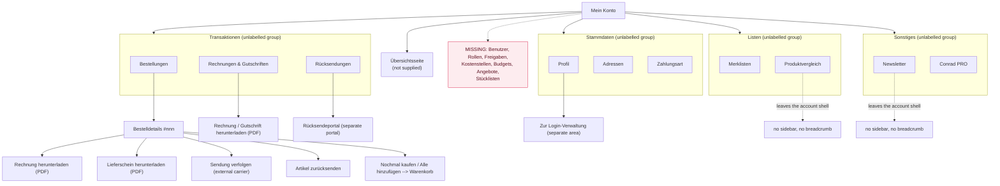

# 01 Analysis: Conrad account area (production)

Basis: 11 desktop screenshots of the live account area, German UI. No research
folder (`./input/research/`) was supplied, so **no finding in this document is
backed by user research**. Evidence is classified as:

- **observed**: directly visible as a defect or inconsistency in the supplied
  artefacts. Anyone can check it against the screenshot.
- **heuristic**: a judgement against Nielsen plus the B2B criteria in the brief.
  Plausible, not proven.

Severity: **4** critical (blocks or misleads on a core task), **3** serious
(costs time on a frequent task), **2** moderate, **1** cosmetic.

---

## Executive summary

1. **There is no company layer.** No users, roles, permissions, approvals, cost
   centres or budgets anywhere in the navigation. For a purchaser, an office
   manager or a company admin this is the account area's reason to exist, and it
   is absent. (A6)
2. **The order total contradicts itself.** "Bruttopreis 285,00 €", then
   "MwSt. 45,50 €", then "Gesamtpreis 285,00 € inkl. MwSt.". The VAT line sits
   between two identical figures and reads as an addition that never happens.
   The net price is never shown, although these are business customers. (B8)
3. **Two rows in the order list render as grey placeholder bars** with a date, a
   price and a "Versendet" badge but no product, no title, no tracking. Either a
   stuck loading state or missing data, presented as if it were a real order. (B2)
4. **A column exists that never carries data.** "Zahlungsstatus" is empty on the
   three current orders and shows "-" on the older two. (B1)
5. **Invoices cannot be searched, selected in bulk or exported.** Three
   dropdowns and a scroll. Month end reconciliation is the single most repetitive
   task in this area and it is unsupported. (C1, C2)
6. **Two account entries leave the account shell.** "Newsletter" and
   "Produktvergleich" render without the left navigation and without a
   breadcrumb, with a different container and a yellow CTA that appears nowhere
   else. The user loses both context and the way back. (A1, A2)
7. **Reordering costs an extra step.** The most frequent B2B task has no action
   on the order list, only inside the order detail. (B3)
8. **The system tells the user twice that bank details are missing and offers no
   path.** A banner on the order page and a dead card on the profile page, no
   link between them. (B12, F5)
9. **Placeholder as label, and decorative asterisks.** Email and order number
   fields carry only a placeholder. Filter dropdowns are labelled "Status*",
   "Zeitraum*", "Sortierung*" although nothing is required. (H3, H4, B5)
10. **The biggest opportunity is a dashboard that does not exist.** Eleven flat
    navigation items with no overview of what needs attention: open invoices,
    shipments in transit, returns in progress, approvals waiting.

---

## 1. Screen inventory

| # | Screen | Path (from breadcrumb) | Purpose | Primary task | State |
|---|---|---|---|---|---|
| S1 | Bestelldetails 2017621738 | Mein Konto > Bestellungen > Bestelldetails | Show one order, its shipment, totals and documents | Check status, download invoice, reorder, start return | filled, one line item, completed |
| S2 | Conrad PRO | Mein Konto > Conrad PRO | Sell the membership | Start the trial | non member |
| S3 | Conrad Newsletter abonnieren | none shown | Subscribe | Enter e-mail and subscribe | empty form |
| S4 | Produktvergleich | none shown | Compare products | Add articles, compare | empty |
| S5 | Merklisten | Mein Konto > Merklisten | Manage saved lists | Open a list, create a new one | filled, 2 lists |
| S6 | Rechnungen & Gutschriften | Mein Konto > Rechnungen & Gutschriften | Find and download accounting documents | Download an invoice, check payment status | filled, 4 documents across 3 months |
| S7 | Rücksendungen | Mein Konto > Rücksendungen | Track returns, start a new one | Start a return | empty |
| S8 | Meine Bestellungen | Mein Konto > Bestellungen | Find an order | Search, open detail, download invoice | filled, 5 rows, 2 of them degraded |
| S9 | Zahlungsart | Mein Konto > Zahlungsart | Choose the default payment method | Change method | filled, "Rechnung" selected |
| S10 | Adressen | Mein Konto > Adressen | Manage billing and delivery addresses | Add or edit an address | filled, 1 billing, 1 delivery |
| S11 | Profil | Mein Konto > Profil | Personal data, login, bank details | Edit data | partially filled, no bank details |

Not supplied although present in the navigation: **Übersichtsseite**. See open
questions.

---

## 2. Current information architecture

The left navigation carries eleven flat entries in four visual groups separated
by hairlines, but the groups are not labelled and the grouping logic is not
obvious (Bestellungen, Rücksendungen and Rechnungen sit together, which works,
while Merklisten and Produktvergleich form a pair that mixes a saving tool with a
comparison tool).

### Structural observations

- **Three exits without warning.** "Rücksendeportal", "Zur Login-Verwaltung" and
  "Sendung verfolgen" all leave the account area. Only the tracking link is
  marked with an external icon.
- **Two entries break the shell.** Newsletter and Produktvergleich, see A1.
- **No cross links where the tasks actually connect.** The invoice on S1 and the
  invoice on S6 are the same document reached through two unconnected routes.
  The IBAN banner on S1 does not link to the bank details on S11.
- **Dead end at the bottom of every page.** After the content, the full marketing
  footer. No "what next" inside the account context.

---

## 3. Findings

| ID | Screen | Element | Issue | Heuristic / criterion | Sev | Evidence | Recommendation |
|---|---|---|---|---|---|---|---|
| A1 | S3, S4 | left navigation | Both pages render without the "Mein Konto" sidebar and without a breadcrumb, although both are reached from that sidebar. The user loses the context and the way back. | Consistency and standards; user control and freedom | 3 | observed | Wrap both in the account shell. |
| A2 | S3 | page container, CTA | Different container width, different card treatment, and a yellow primary button used nowhere else in the account area. | Consistency and standards | 3 | observed | Rebuild inside the shell with the standard primary button. |
| A3 | all | footer + newsletter bar | The full marketing footer (about 60 links) plus the newsletter promo bar repeat on every task page. On S4 and S7 the footer is several times taller than the content. | Aesthetic and minimalist design | 2 | observed | Reduce to a legal bar in the account area, as `cart.html` already does in the prototype. |
| A4 | S2, S4, S7 | content area | Large empty vertical band between content and footer. Symptom of A3 plus thin pages, not a separate defect. | Aesthetic and minimalist design | 1 | observed | Resolve with A3 and a dashboard. |
| A5 | nav | "Übersichtsseite" | Exists in the navigation, not supplied. Purpose unknown. | n/a | n/a | open question | See section 7. |
| A6 | nav | missing group | No company user management, roles, permissions, approval workflow, cost centres or budgets anywhere. For purchasers, office managers and company admins this is the core of a B2B account. | Match between system and the real world; multi user and role support | 4 | heuristic | Add a "Unternehmen" group: Benutzer & Rollen, Freigaben, Kostenstellen, Budgets. |
| A7 | nav | 11 flat entries | Four unlabelled hairline groups, no headings, no counts, no indication of what needs attention. | Recognition rather than recall | 2 | heuristic | Label the groups and put counts on Bestellungen, Rücksendungen, Rechnungen. |
| A8 | nav | "Stücklisten", "Angebotsanforderung" | Both exist in the prototype's Konto drawer and both are core B2B tasks, but neither appears in the production account navigation. | Flexibility and efficiency of use | 3 | observed | Reconcile the two navigations. |
| B1 | S8 | column "Zahlungsstatus" | The header is rendered but carries no value on the three current orders and "-" on the two older ones. A column that never shows anything. | Visibility of system status | 3 | observed | Fill it (offen, bezahlt, überfällig) or remove it. |
| B2 | S8 | rows 4 and 5 | Two rows render as grey placeholder bars with a "Versendet" badge, a date and a price, but no title, no images, no tracking, no invoice. Presented as if they were real orders. | Visibility of system status; error prevention | 4 | observed | If archived, label the row and explain. If loading, use a real skeleton with an accessible loading message and a failure path. |
| B3 | S8 | order card | No reorder action on the list. Reordering requires opening the detail first. Repeat ordering is the most frequent task in a B2B account. | Flexibility and efficiency of use; speed for repeat tasks | 3 | heuristic | Put "Nochmal kaufen" on every row of the list. |
| B4 | S8 | filter row | Only a free text search and a time window. No filter by status, orderer, cost centre or amount, no sort control, no export. | Flexibility and efficiency of use; search, filter, sort, export | 3 | heuristic | Add status and orderer filters, a sort control and a CSV export. |
| B5 | S8, S6, S7 | "Artikel, Schlagwort oder Bestellnummer*", "Status*", "Zeitraum*", "Sortierung*" | An asterisk on four controls with no legend anywhere. By convention it means "required", and here nothing is required. | Consistency and standards | 2 | observed | Remove the asterisks. |
| B6 | S1 | "Alle hinzufügen" | The action that reorders the whole order is a small text link beside the order number, visually weaker than "Nochmal kaufen" on the single line item. | Aesthetic and minimalist design | 2 | heuristic | Promote to a secondary button in the page header. |
| B7 | S1 | kebab menu (⋮) | Unlabelled overflow menu in the page header. Contents unknown from the screenshot. | Recognition rather than recall | 2 | observed + open question | Label or dissolve into visible actions. |
| B8 | S1 | Bestellsumme | "Bruttopreis 285,00 €", "MwSt. 45,50 €", "Gesamtpreis 285,00 € inkl. MwSt.". VAT sits between two identical figures and reads as an addition that does not happen. The net amount (239,50 €) never appears, although these are business customers and the prototype shows net everywhere. | Match between system and the real world; error prevention | 4 | observed | Show Nettopreis, Versand, MwSt., Gesamtpreis, and follow the same price mode as PDP and cart. |
| B9 | S1 | "Versand" block | Two lines with the same information: an indented "Conrad Electronic kostenfrei" and a "Gesamte Versandkosten kostenfrei". Only meaningful with several shipments. | Aesthetic and minimalist design | 2 | observed | Collapse to one line when there is one shipment. |
| B10 | S1 | "Sendung verfolgen: 00340161386265956229" | A 20 digit number as the complete link text. No carrier, no current status, hard to scan or quote. | Recognition rather than recall; WCAG 2.4.4 | 2 | observed | Show carrier plus status as the link, put the number in a copy chip (`.id-chip-value` exists in the prototype). |
| B11 | S1 | order header vs shipment card | Three status statements in one view: "Abgeschlossen am 10.04.2026", badge "Versendet", "voraussichtlicher Liefertermin: 15.04.2026". The first two contradict each other. | Visibility of system status | 3 | observed | One status per level: order status in the header, shipment status on the shipment. |
| B12 | S1 | IBAN info banner | "Bitte hinterlegen Sie eine gültige IBAN in Ihrem Kundenkonto" at the bottom of an order page, with no link to where that is done, and no explanation of what it blocks. | User control and freedom; help users recover | 3 | observed | Link to Profil > Bankverbindung and say what it affects (refunds). |
| B13 | S1 | "Bestell-Nr.: 3413014 - 62" | The suffix "- 62" is unexplained. Position number, line number or pack size is not derivable. | Match between system and the real world | 1 | observed + open question | Label the parts. |
| C1 | S6 | document list | No bulk selection and no export. Reconciling a month means downloading each PDF individually. No CSV, no DATEV, no ZIP. | Flexibility and efficiency of use; export on list views | 4 | heuristic | Checkbox column, "Auswahl herunterladen", "Export (CSV)". |
| C2 | S6 | filter row | No search field at all. Finding invoice 9784437946 means scrolling the whole period. | Flexibility and efficiency of use | 3 | observed | Add search by document number, order number and amount. |
| C3 | S6 | Gutschrift status | The credit note carries the same status vocabulary as an invoice ("offen"). For money owed to the customer this is ambiguous. | Match between system and the real world | 2 | heuristic | Separate vocabulary for credit notes (for example "in Erstattung", "erstattet"). |
| C4 | S6 | status | Only "offen" and "ausgeglichen". An invoice past its due date looks the same as one issued yesterday, and the due date is never shown. | Visibility of system status | 3 | heuristic | Add "überdue" state plus the due date on every open document. |
| C5 | S6 | Gutschrift thumbnail | A generic broken image placeholder where the other rows carry product images. | Error prevention; aesthetic | 2 | observed | Use a document glyph for documents without articles. |
| C6 | S6 | month group headers | Grouping by month suits reconciliation, but the headers do not stick on scroll and carry no subtotal. | Flexibility and efficiency of use; data density | 2 | heuristic | Sticky group header with a month total. |
| C7 | S6 | amounts | "285,00 €", "+ 600,00 €", "212,46 €", "22,94 €". Gross or net is never stated. | Match between system and the real world | 3 | observed | State the basis, consistent with B8. |
| D1 | S7 | "Rücksendeportal" | The primary action hands the user to a separate portal. No external marker, no statement of what happens, and returns started there appear not to be listed here. | Consistency and standards; user control | 3 | observed + open question | Bring the start of a return into the account area, or mark the handover and reflect its result. |
| D2 | S7 | empty state | "Noch keine Rücksendungen vorhanden" as a bare sentence under a filter. No guidance on deadlines, conditions, which orders are still returnable, or how to start. | Help and documentation | 2 | observed | Use the prototype's empty state pattern: title, one sentence, primary action, plus the return window rules. |
| D3 | S6, S7, S8 | default time window | Returns default to 6 months, invoices to 12, orders to 24. Three defaults, no stated reason. | Consistency and standards | 2 | observed | One default (12 months) unless there is a legal reason. |
| E1 | S5 | list names | Auto generated "Merkliste vom 03.07.2026". A buyer who keeps lists per project, site or cost centre gets the least useful name possible. | Match between system and the real world | 3 | heuristic | Prompt for a name on creation, keep the date as metadata. |
| E2 | S5 | list cards | One card shows a product thumbnail, the other shows only a vertical rule. Same content type, two renderings. | Consistency and standards | 2 | observed | One card rendering, with a placeholder glyph when no image exists. |
| E3 | S5 | card content | "1 Artikel" is the only signal. No total value, no availability, no action (open, order, share, export). | Flexibility and efficiency of use | 2 | heuristic | Add value, availability summary and a direct "In den Warenkorb". |
| E4 | S4 | "Merken", "Löschen" | Both rendered as enabled while the comparison is empty. | Error prevention | 2 | observed | Disable or hide until there is content. |
| E5 | S4 | empty state | The only offered path is adding by order number. A user arriving from a category page has no way back to products. | User control and freedom | 2 | heuristic | Add a link into the catalogue and explain what comparison does. |
| F1 | S9 | payment selection | No save action visible. Whether the radio persists immediately is not stated, and no confirmation is shown. | Visibility of system status | 3 | observed + open question | Confirm the change explicitly (toast pattern exists in the prototype). |
| F2 | S9 | right hand chips | PayPal and Kreditkarte carry brand logos. Rechnung, Bankeinzug and Vorauskasse carry a grey chip that repeats the label already present on the left of the same row. | Consistency and standards; aesthetic | 2 | observed | Drop the text chips, keep logos only. |
| F3 | S10 | address fields | No company line, no department, no cost centre, no free label ("Werk 2", "Baustelle Nord"), no contact person per address. | Match between system and the real world; multi user support | 3 | heuristic | Extend the address model for B2B. |
| F4 | S10 | Lieferadresse card | The delivery address has no edit and no delete control, while the billing address has "bearbeiten". | Consistency and standards; user control | 3 | observed | Same controls on both cards. |
| F5 | S11 | Bankverbindung | "Noch keine Kontodaten hinterlegt" inside a card whose only action is a small "Bearbeiten" in the card header. Together with B12 the user is told twice that something is missing, with no direct path either time. | Help users recognise and recover | 3 | observed | Primary action inside the empty card, linked from the banner in B12. |
| F6 | S11 | "Kundennummer: 0016297222" | Plain text beside the heading, not copyable, although it is the number customer service asks for first. | Flexibility and efficiency of use | 1 | heuristic | Use the existing `.id-chip-value` copy chip. |
| F7 | S2 | price | The page states 19,95 € per year incl. VAT. The prototype's PDP and cart advertise 59 € per year excl. VAT for the same membership. | Consistency and standards | 3 | observed | Reconcile before Phase 2. Whichever is right, the prototype has to follow production. |
| F8 | S2 | page | One offer card on an otherwise empty page. No membership state for members, no membership invoices, no cancellation path, although the fine print promises "jederzeit im Kundenkonto gekündigt werden". | Visibility of system status | 2 | observed | Add the member state to the same route. |
| G1 | all | header search placeholder | The placeholder rotates ("Suche nach Hersteller", "Suche nach EAN", "Suche nach Produkt") and was captured mid animation as "Suche nach P". Moving text in a persistent field is distracting and unreadable at the moment it changes. | Aesthetic and minimalist design; WCAG 2.2.2 | 3 | observed | Stop the animation or give a pause control. |
| G2 | all | "Feedback" tab | Fixed vertical tab on the right edge, overlapping the content column, rotated text, small target. | Aesthetic; WCAG 2.5.8 | 2 | observed | Move out of the content column. |
| G3 | all | header badges | The wishlist badge shows "2" on every screen; the cart badge shows nothing at all, not even a zero. Two counters, one convention. | Consistency and standards | 1 | observed | One rule for both. |
| G4 | S1 to S11 | header | The "Geschäftskunde / Privatkunde" price switch that the prototype carries in the header is not visible on any account screen. | Consistency and standards | 3 | observed + open question | Clarify whether the switch is absent for logged in business accounts, and align with B8 and C7. |

---

## 4. Accessibility check (visual only)

This is a **visual inspection of static screenshots**. It is not an audit. No DOM,
no contrast measurement, no keyboard walkthrough, no screen reader. Every item
below needs confirmation against the live page.

| ID | Screen | Issue | WCAG 2.2 AA ref | Sev | Evidence |
|---|---|---|---|---|---|
| H1 | S8, S1 | "Versendet" badge: grey text on a light grey chip. Visually the weakest text on the page and it carries the status. | 1.4.3 Contrast (Minimum) | 3 | heuristic, measure |
| H2 | S8 | The two degraded rows carry their meaning through shape and colour only. A non visual user receives a row with a date and a price and no name. | 1.1.1, 1.4.1 | 3 | observed |
| H3 | S3, S4 | "Bitte tragen Sie eine E-Mail ein." and "Bestellnummer" exist only as placeholders. Placeholder as label disappears on first keystroke. | 3.3.2 Labels or Instructions | 3 | observed |
| H4 | S6, S7, S8 | Filter controls labelled "Status*", "Zeitraum*", "Sortierung*" and a search labelled with a trailing asterisk. No legend. The asterisk convention signals required, and nothing here is. | 3.3.2 | 2 | observed |
| H5 | S3, all | The blue "Der Conrad Newsletter" block and the "10 €-Gutschein" graphic in the global bar appear to be images containing text. | 1.4.5 Images of Text | 2 | heuristic, check DOM |
| H6 | S1 | The tracking link's entire text is a 20 digit number. Out of context it states no purpose. | 2.4.4 Link Purpose | 2 | observed |
| H7 | all | No focus indicator is visible in any screenshot. Cannot be assessed from static images. | 2.4.7, 2.4.11 | n/a | open question |
| H8 | all | "Feedback" tab: rotated text in a narrow fixed tab, target likely under 24 by 24 CSS px in one dimension. | 2.5.8 Target Size (Minimum) | 2 | heuristic, measure |
| H9 | S6 | **Positive**: payment status uses a coloured dot **plus** a word ("offen", "ausgeglichen"), so it does not rely on colour alone. Keep this pattern. | 1.4.1 | n/a | observed |
| H10 | S9 | **Positive**: the payment options are full width rows with a large hit area and a visible selected state (blue fill plus border). | 2.5.8 | n/a | observed |
| H11 | S1 | Three headings compete at similar weight ("Bestellung #2017621738", "Lieferung", "Bestellübersicht", "Zurücksenden"). Heading level order cannot be verified visually. | 1.3.1 | n/a | open question |

---

## 5. Responsive behaviour

**Gap.** Only desktop screenshots were supplied. No mobile or tablet artefact
exists, so no comparison is possible.

What can be said without mobile screenshots, and what has to be checked:

- S6, S8 and S1 are horizontal in structure (multi column rows with date, price,
  shipment, payment status, invoice). At 640 px these either reflow into stacked
  cards or scroll. The prototype's answer for the stueckliste table is horizontal
  scroll. Which one production uses is unknown.
- The left "Mein Konto" navigation has no visible mobile equivalent in any
  screenshot. Whether it becomes a drawer, a select or a top strip is unknown.
- The filter rows on S6 and S7 place three dropdowns side by side. Their mobile
  behaviour is unknown.

**Action for Phase 1 completion**: mobile screenshots of S1, S6 and S8 would
change the weighting of findings B1, B4, C1 and C6, because bulk actions and
dense columns behave very differently on a phone.

---

## 6. Gap to the prototype

How far the production account area sits from the baseline in
`00-prototype-baseline.md`.

| Dimension | Production account area | Prototype (PDP, cart) | Distance |
|---|---|---|---|
| Page shell | promo strip, header, breadcrumb, **left sidebar nav**, full marketing footer | promo strip, header, breadcrumb, no sidebar, legal bar footer on cart | medium: the sidebar is new, the footer must shrink |
| Layout grid | fixed content column roughly 1150 px, sidebar about 250 px | `max-width: 1680px`, content grids `1fr 360px` and `1fr 400px` | large: the account area is much narrower than the prototype's canvas |
| Price framing | gross ("Bruttopreis", "inkl. MwSt.") | net by default, `zzgl. MwSt.`, with a header switch | large, and it is a contradiction, not just a difference (B8, C7, G4) |
| Cards | white, roughly 8 px radius, thin border, generous padding | `.cart-card` white, `--radius` 8 px, 1 px `--c-border` | small: close enough to reuse directly |
| Buttons | blue primary, white outline secondary, **yellow** on the newsletter page, pill and rounded mixed | blue primary, `--c-blue-soft` secondary, ghost tertiary, 4 to 6 px radius, no pill | medium: drop the yellow, unify the radius |
| Status | coloured dot plus word (invoices), grey chip (orders) | `.bom-status` pill with background plus dark text, three variants | medium: one pattern replaces two |
| Tables and lists | card rows with pseudo columns, no real table | `.bom-table` with horizontal scroll | medium: the account lists are the reason to promote `.bom-table` to a shared component |
| Empty states | a bare sentence (S7), or controls with nothing to act on (S4) | `.cart-empty` with title, sentence, primary and secondary action | large: production has no empty state pattern |
| Loading states | degraded grey rows with no explanation (S8) | none at all | both sides are missing this |
| ID handling | plain text (Kundennummer, Bestell-Nr., tracking number) | `.id-chip-value` with copy action and confirmation | small, and an immediate win |
| Navigation into the cart | "Nochmal kaufen", "Alle hinzufügen" | `conradCart` in `localStorage`, read by all pages | small: wire the account reorder into the same key |
| Account IA | 11 flat entries | the Konto drawer already lists 11, including Stücklisten and Angebotsanforderung | the two lists must be reconciled (A8) |
| Conrad PRO price | 19,95 € / year incl. VAT | 59 € / year excl. VAT | contradiction, must be resolved (F7) |

**Summary**: the visual distance is small. Cards, colours, radii and button
hierarchy are close enough that the account pages can be built from the existing
tokens without inventing a new look. The structural distance is large: the
prototype has no sidebar layout, no list view pattern, no loading state, and the
price framing is the opposite of production's.

---

## 7. Open questions

Things I will not guess at. Each one changes the concept if answered differently.

1. **Übersichtsseite**: what is on it today? Link list or real dashboard? This
   determines whether Phase 2 proposes a new dashboard or a rework. (A5)
2. **Kebab menu on S1**: what is inside? (B7)
3. **Rows 4 and 5 on S8**: loading state, archival limit, or data error? The
   recommendation differs completely. (B2)
4. **Zahlungsstatus on S8**: is the column empty because the data is missing, or
   because these orders have no payment status yet? (B1)
5. **Zahlungsart on S9**: does selecting a radio save immediately? (F1)
6. **Rücksendeportal**: is it a separate system? Do returns started there appear
   under "Meine Rücksendungen"? (D1)
7. **Zur Login-Verwaltung**: separate identity system, or the same account? (S11)
8. **Geschäftskunde switch**: why is it not in the header on account pages? Is it
   hidden for logged in business accounts, and if so, is the account area fixed
   to gross prices? (G4, B8)
9. **"Bestell-Nr.: 3413014 - 62"**: what is the "- 62"? (B13)
10. **Company accounts**: does Conrad have a multi user B2B account at all today,
    reached elsewhere (Conrad Sourcing Platform, Smart Procure, the E-Procurement
    entries in the footer)? If the company layer lives in a separate product, A6
    changes from "build it" to "link it".
11. **Conrad PRO price**: 19,95 € incl. VAT or 59 € excl. VAT? (F7)
12. **Mobile**: are mobile screenshots available? (section 5)
13. **Fuse**: is the account concept expected as static HTML in this repository,
    or as shadcn-vue + Tailwind? The repository contains neither. (baseline §1)

---

## 8. Finding count by severity

59 rows in total: 48 in the findings table, 11 in the accessibility table.

| Severity | Count | IDs |
|---|---|---|
| 4 critical | 4 | A6, B2, B8, C1 |
| 3 serious | 23 | A1, A2, A8, B1, B3, B4, B11, B12, C2, C4, C7, D1, E1, F1, F3, F4, F5, F7, G1, G4, H1, H2, H3 |
| 2 moderate | 23 | A3, A7, B5, B6, B7, B9, B10, C3, C5, C6, D2, D3, E2, E3, E4, E5, F2, F8, G2, H4, H5, H6, H8 |
| 1 cosmetic | 4 | A4, B13, F6, G3 |
| not rated | 5 | A5, H7 (cannot assess), H9, H10 (positive), H11 (cannot assess) |

Evidence split: **39 observed, 17 heuristic, 3 open question only, 0 backed by
research.** The heuristic share is concentrated in the B2B criteria (company
layer, bulk export, reorder speed, address model), which is exactly where
research would change the weighting most. See open question 10.
