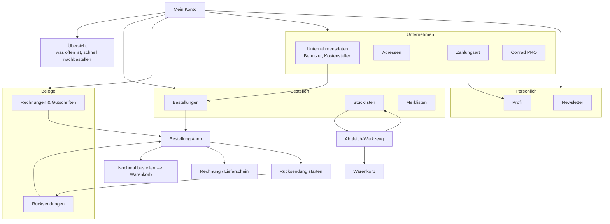

# 02 Concept: Conrad account area

Phase 2. Built on the findings in `01-analysis.md`, the baseline in
`00-prototype-baseline.md`, and the corrections received:

- build the pages the way the prototype is built, ignore Fuse, shadcn and Tailwind
- simple company layer, no roles, no permissions, no approvals
- net prices throughout, the production screens are B2C
- the degraded rows in the order list were a loading state
- bulk download and export: recommendation wanted
- Conrad PRO at 19,95 € is the B2C price, not relevant here
- mobile comes later

Branch: `concept/account-area`. `wago221.html`, `cart.html` and
`stueckliste.html` are untouched.

---

## 1. Design principles

Five, each tied to the findings it answers.

### P1 Was offen ist, steht vorn

The account area opens with what needs a decision today, not with a copy of the
navigation. Open invoices, shipments in transit, returns under review. If
nothing is open, the band is empty and the page starts with the work.

Answers A9, B1, C4, and the missing overview in the executive summary.

### P2 Jede Liste kann man durchsuchen, filtern und mitnehmen

Every list view has a search field, filters that match how a buyer thinks
(status, orderer, cost centre), and an export. A list that can only be scrolled
is not a working tool for someone reconciling a month.

Answers B4, C1, C2, C6.

### P3 Eine Preisgrundlage

Netto everywhere, `zzgl. MwSt.` stated, VAT shown as its own line that actually
adds up. The account area follows the same basis as PDP and cart.

Answers B8, C7, G4.

### P4 Ein Weg, nicht zwei

Every account task stays inside the account shell. Every hint carries the link
to the place where it is resolved. No page tells the user that something is
missing without offering the way there.

Answers A1, A2, B12, D1, F5.

### P5 Wiederholen ist ein Klick

Reordering is available wherever an order or an article is shown: on the
dashboard, on the list, on the detail page, per position and for the whole
order.

Answers B3, B6, A14.

---

## 2. Target information architecture

This section shows the navigation **as built**. Sections 9 to 13 are the change
log that led here.



### What changed against production, and why

| Change | Rationale | Finding |
|---|---|---|
| Groups are labelled | Four silent hairlines forced the user to infer the grouping | A7 |
| New group "Unternehmen": Unternehmensdaten (with Benutzer and Kostenstellen), Adressen, Zahlungsart, Conrad PRO | The company layer was missing entirely. Addresses, payment method and the PRO subscription all belong to the company account, not to the person | A6 |
| New group "Persönlich": Profil, Newsletter | What is actually personal, separated from what is the company's | A7 |
| "Stücklisten" enters the navigation as a place, with its own list page | A core B2B task, already present in the prototype's own account drawer. As a link to the tool it would have reproduced A1 | A8 |
| Counters on Bestellungen, Rechnungen, Rücksendungen | The sidebar says where something is waiting without a click. One design, no colour variants: a counter means "something is waiting", not "this many exist" | A7 |
| Produktvergleich leaves the account navigation | A shopping tool, not account data. It belongs next to the catalogue, which also removes one of the two pages that broke the shell | A1 |
| Newsletter stays, but inside the shell | Same reason, other direction: it is a setting of this account | A1, A2 |
| Belege cross link to the order and back | The same document was reachable by two unconnected routes | IA observations |
| Benutzer and Kostenstellen link into a filtered order list | The question "what did Sabine order on KST-4100" now has one path | A6 |

Not in scope and therefore without a page: "Angebotsanforderung". It sits in the
existing header drawer and has no production screenshot behind it.

## 3. Dashboard

Replaces a page that mirrored the navigation (A9). Four bands, in the order a
buyer needs them.

**1. Was offen ist.** Up to four tiles, each one a link into a pre filtered
list. Only what is non zero appears.

| Tile | Value | Note | Links to |
|---|---|---|---|
| Offene Rechnungen | sum net | how many are overdue | invoices, filtered to open |
| Sendungen unterwegs | count | next delivery date | orders, filtered to shipped |
| Bestellungen in Bearbeitung | count | date of the latest | orders, filtered |
| Rücksendungen in Prüfung | count | the RMA number | returns |

The overdue tile is the only one with a warning colour. Colour is never the only
carrier: the note says "1 davon überfällig" in words.

**2. Schnell nachbestellen.** The four most recently ordered articles, each one
only once, with the date, the order they came from, the unit price net, and one
button. This is the highest frequency task in the whole area and in production
it required opening an order first (B3).

**3. Letzte Bestellungen und offene Rechnungen**, side by side. Each row carries
a status pill, an amount and a link. The invoice rows state the due distance in
plain words ("fällig in 4 Tagen", "fällig seit 10 Tagen"), which is what C4 asks
for.

**4. Stammdaten**, three small cards: standard delivery address, payment method,
company. These are the only parts of the old dashboard worth keeping, and they
sit at the bottom because they are consulted rarely.

Not on the dashboard: Profil (A10, A11 removed with it), Merklisten (nothing
actionable to show), Produktvergleich, Newsletter.

---

## 4. Key flows

### 4.1 Find an order and check its status

| Before | After |
|---|---|
| Time window filter and a free text search with an unexplained asterisk. No status filter, no sort, no orderer. A "Zahlungsstatus" column with no values. Two rows rendered as grey bars with no explanation. | Search over number, article and reference. Filters for status, orderer and cost centre. Every column carries data. One status pill per order with the vocabulary of the order, plus "1 Position offen" on a partial shipment. |
| On the detail page: "Abgeschlossen am ...", a badge "Versendet" and a future delivery date in the same block. | One status per level: the header states who ordered, when, on which cost centre. The shipment card carries the shipment status, the carrier, the date and a four step line from Bestellt to Zugestellt. |
| Tracking number as a 20 digit link. | Copy chip with the number plus a separate link "Bei DHL verfolgen". |

Solves B1, B2, B4, B5, B10, B11, and the loading state that produced B2.

### 4.2 Reorder from the order history

| Before | After |
|---|---|
| Only inside the detail page: "Nochmal kaufen" per line, "Alle hinzufügen" as a weak text link next to the order number. | Dashboard: four articles with one button each. List: "Nochmal bestellen" on every row, which adds all positions. Detail: a primary button for the whole order plus one button per position. |

The reorder writes into `conradCart`, the same `localStorage` key the cart page
reads, so the line appears in the real cart with its image, pack size and net
price. Verified end to end: an order with a net total of 356,90 € produces a
cart with a net total of 356,90 €.

Solves B3, B6, A14, P5.

### 4.3 Find and download invoices, single and bulk

This is finding C1, the one where a recommendation was asked for.

**What a buyer actually does at month end.** Open the list, restrict to a
period, pick everything that belongs to that period, and hand the result to
accounting or to the tax adviser. In production none of the four steps is
supported: no search, no selection, no bulk action, no export.

**Recommendation, in three stages.**

*Stage 1, what the prototype shows.* A checkbox column with a select all in the
header, a bar that appears as soon as something is selected, "Auswahl als PDF
herunterladen" and "Auswahl als CSV". Plus a search over document number, order
number and amount, a status filter that includes "Überfällig", and a due date
column that says how many days are left or how many have passed. The CSV is
written with a semicolon separator, a comma as the decimal mark and a BOM, so
that a German Excel opens it in columns without an import dialogue.

*Stage 2, what a real implementation needs.* The bulk PDF has to be a server
side ZIP, not n browser downloads. Naming matters more than it looks:
`Rechnung_9784752944_2026-09-19.pdf` is what a document management system can
file automatically. The export needs a second format next to CSV, and for German
B2B that is DATEV, because the tax adviser imports it directly.

*Stage 3, what removes the task.* ZUGFeRD or XRechnung as a hybrid PDF means the
invoice carries its own structured data and the customer's ERP books it without
anyone downloading anything. At that point the list stops being a working tool
and becomes an archive, which is the right outcome.

I would not build a DATEV export before someone has confirmed that Conrad's
B2B customers actually use one. That is the first thing to test, see section 7.

Also solved here: C2 (search), C3 (credit notes get their own status vocabulary,
"Erstattet" instead of "offen"), C4 (overdue plus due date), C5 (no broken
thumbnails, documents are documents), C7 (net stated).

### 4.4 Start a return

| Before | After |
|---|---|
| "Rücksendeportal" hands the user to a separate system with no marker and no return path. The empty state is one sentence under a filter. | The return starts in the account area, from the order detail or from the returns page. The empty state carries the rules the user needs: 30 days after delivery, unopened packaging units longer, credit note always from Conrad Electronic even when a marketplace participant shipped. |
| Time window defaults to 6 months while invoices use 12 and orders 24. | One default. |
| Returns list has no link to the order. | Every return links to its order, every delivered order shows its return. |

Solves D1, D2, D3.

### 4.5 Manage company users

Deliberately the simple stage, as agreed: who orders, and what is booked where.
No roles, no permissions, no approval workflow.

- **Unternehmensdaten**: company, address, customer number as a copy chip, VAT
  ID, payment method and term, and the statement that prices are net.
- **Benutzer**: name, e-mail, function, cost centre, member since, number of
  orders, and a link into the order list filtered to that person. "Benutzer
  hinzufügen" sends an invitation. Function ("Einkauf", "Technik",
  "Buchhaltung") is a label, not a permission.
- **Kostenstellen**: number, name, order count and net total, each linking into
  the filtered order list.

A note at the top states plainly that rights, roles and approvals are not part
of this draft, so that nobody reviews it expecting them.

Solves A6 at the agreed depth.

---

## 5. Prototype pages

### How to run

No build step. Serve the repository and open a page.

```bash
python3 -m http.server 8901
```

Or use the existing preview entry `conrad-pro` in `.claude/launch.json`.

### Routes

| URL | Page |
|---|---|
| `konto.html` | Übersicht (dashboard) |
| `konto-bestellungen.html` | order list |
| `konto-bestellungen.html?status=versendet` | pre filtered, as the dashboard links it |
| `konto-bestellungen.html?person=u2` | orders of one user |
| `konto-bestellungen.html?kst=KST-4100` | orders on one cost centre |
| `konto-bestellungen.html?zustand=laden` | loading state |
| `konto-bestellungen.html?zustand=fehler` | error state |
| `konto-bestellungen.html?zustand=leer` | empty state |
| `konto-bestellung.html?nr=2017621738` | order detail, in Bearbeitung |
| `konto-bestellung.html?nr=2017619004` | order detail, versendet, marketplace shipper |
| `konto-bestellung.html?nr=2017551903` | order detail, teilweise versendet |
| `konto-bestellung.html?nr=9999` | order not found |
| `konto-rechnungen.html` | invoices and credit notes, with bulk selection |
| `konto-rechnungen.html?status=offen` | pre filtered |
| `konto-ruecksendungen.html` | returns |
| `konto-ruecksendungen.html?zustand=leer` | returns, empty state |
| `konto-stuecklisten.html` | saved bills of material |
| `konto-stuecklisten.html?zustand=leer` | empty state |
| `konto-merklisten.html` | wishlists |
| `konto-unternehmen.html` | company data, users, cost centres |
| `konto-adressen.html` | billing and delivery addresses |
| `konto-zahlungsart.html` | payment method, with explicit save |
| `konto-profil.html` | personal data, access, bank details |
| `konto-newsletter.html` | newsletter topics |
| `konto-pro.html` | Conrad PRO membership |
| `stueckliste.html` | the matching tool, now inside the account shell |

Paths worth walking:

- **Reorder**: `konto-bestellungen.html`, "Nochmal bestellen" on any row, then
  `cart.html`.
- **Bill of material**: `stueckliste.html`, example list, match, then either
  "In den Einkaufswagen" or "Als Stückliste speichern", which lands on
  `konto-stuecklisten.html` with a confirmation.
- **Month end**: `konto-rechnungen.html`, select all, "Auswahl als CSV".

### Files added

| File | Role |
|---|---|
| `konto.css` | shared stylesheet: the two style blocks of `cart.html` verbatim, plus the toast rules and the status pill from the other two pages, plus the KONTO section |
| `konto-daten.js` | fixtures and helpers, plus the reorder into `conradCart` and the navigation counters |
| `konto.html` and five further `konto-*.html` | the pages |

Nothing existing was modified.

### Mock data

One company with three users and three cost centres, seven orders across five
status values, six documents including one credit note and one overdue invoice,
two returns. Article numbers, EAN and images are the real ones from the
prototype, so a reorder produces a working cart line rather than a name.

---

## 6. Consistency check and component mapping

### Existing components used

| Component | Origin | Used on |
|---|---|---|
| page shell: promo strip, header, both drawers, breadcrumb, legal bar footer, to top | `cart.html` verbatim | all six pages |
| `.bom-status` `.ok` `.warn` `.err` | `stueckliste.html` | every status, on all six pages |
| `.bom-table` conventions: uppercase headers, 12 px padding, horizontal scroll wrapper | `stueckliste.html` | order list, invoices, returns, users, cost centres |
| `.cart-card` surface: white, 8 px radius, 1 px `--c-border` | `cart.html` | every card |
| `.cart-empty` pattern: title, one sentence, primary plus secondary action | `cart.html` | empty states on four pages |
| `.id-chip-value` copy chip | `wago221.html` | tracking number, customer number |
| `.toast` | `wago221.html` | every confirmation |
| button hierarchy: blue fill, `--c-blue-soft` fill, ghost | all | everywhere |
| hover system by function | commit `63c8d40` | everywhere |
| `conradCart` in `localStorage` | `cart-seed.js` | reorder |
| `header-flyouts.js` | shared | header flyouts and badges |

### New components and why nothing existing fitted

| New | Why |
|---|---|
| `.konto-nav` side navigation with labelled groups and counters | the prototype has no sidebar layout at all, only the header drawer |
| `.konto-kpi` attention tile | nothing in the prototype states a quantity with a route behind it |
| `.konto-toolbar`, `.konto-search`, `.konto-select` | the prototype has no filter row. `.bom-chip` filters by one dimension only and does not scale to four |
| `.konto-bulk` selection bar and `.konto-check` | no multi select exists anywhere |
| `.konto-skeleton` loading row | the prototype has no loading state. This one carries a `visually-hidden` row saying "Bestellungen werden geladen" and `aria-busy`, which is exactly what production's grey bars were missing |
| `.konto-error` | no page level error pattern exists |
| `.konto-note` hint with a built in action | production has hints without a route (B12); this one cannot exist without its link |
| `.konto-steps` shipment progress | nothing comparable exists |
| `.konto-dl`, `.konto-pos`, `.konto-sum` | layout primitives for record pages |

### Deviations from the baseline, declared

1. **A shared stylesheet.** The existing pages carry their CSS inline. Six
   copies of a 2000 line stylesheet would guarantee drift, which
   `00-prototype-baseline.md` §9.1 already names as the baseline's own
   weakness. `konto.css` is a new file and a deliberate deviation. The shell
   markup stays inline per page, as in the existing pages.
2. **Three components had to be copied between pages.** `.visually-hidden`,
   `.toast` and `.bom-status` live in `wago221.html` or `stueckliste.html` but
   not in `cart.html`, whose stylesheet formed the base. They are marked as
   copied in `konto.css`. This is evidence for the shared stylesheet, not
   against it.
3. **Three breakpoints instead of fourteen.** The account pages use 900 and 640
   only. The baseline counts fourteen values across the three existing pages.
4. **`max-width` of the content.** The account pages keep the prototype's
   1680 px, not the roughly 1150 px of the production account area. Consistency
   with PDP and cart was the stated priority.
5. **Net prices.** A deliberate contradiction of the production screens,
   confirmed as intended.

### Proposed changes to existing pages, not implemented

Per the constraint, these are proposals only.

1. **`cart.html` and `wago221.html`, account drawer.** Eleven of the twelve
   entries point at `#`. They should point at the new pages, otherwise the route
   from cart back into the account does not exist. Reorder from the account into
   the cart already works, the reverse does not.
2. **`cart.html`, order confirmation.** There is no confirmation page in the
   prototype. When one is built it should link to `konto-bestellung.html?nr=...`.
3. **`.bom-status` and `.bom-table` into a shared file.** They are now used by
   four pages, not one.

---

## 7. Validation plan

The concept makes six assumptions. Each one can be wrong, and each one has a
cheap test.

| # | Hypothesis | Test | Success metric |
|---|---|---|---|
| H1 | Buyers open the account area to find out what needs attention, not to navigate | Five minute first click test on the dashboard: "You start your working day. What do you check first?" | at least 7 of 10 click inside the attention band |
| H2 | Reorder from the list removes a real detour | Task: "Order the same terminals as in September again." Compare with the production path | median time at least 40 per cent lower, no participant opens the detail page first |
| H3 | Month end needs bulk and export, not a better single download | Task with an accounting role: "Hand August over to your tax adviser." Observe whether they select, export, or download individually | at least 6 of 8 use selection or export. If they download individually, stage 2 of 4.3 is not worth building |
| H4 | The simple company layer is enough, roles are not missed | Interview after the task: "Whose orders can you see here, and whose should you be able to see?" | fewer than 3 of 10 ask for permissions unprompted. If more do, A6 has to grow |
| H5 | Net prices do not confuse | Task: "How much does this order cost you in total?" | no participant reads the net amount as the total |
| H6 | The status vocabulary is understood | Card sort of the seven status words against real situations | at least 80 per cent correct assignment, "Teilweise versendet" is the one to watch |

Two things that cannot be tested this way and need instrumentation instead:
how often the attention band is actually empty, and how many invoices a typical
selection contains. Both decide whether the design scales past this fixture set.

---

## 8. Risks and dependencies

**Data the backend has to provide and might not.**

- Cost centre and orderer per order. Everything in the company layer depends on
  it. If orders are only attached to a customer number, the users page shows
  three rows and the filters do nothing.
- Due date and payment status per invoice. Without them C4 cannot be built, and
  the overdue tile on the dashboard disappears.
- Carrier and shipment status, not only a tracking number. The four step line is
  a promise the data has to keep.
- A reliable article reference per order line. The reorder maps position to
  article, pack size and price. Articles that no longer exist need a rule, and
  the prototype does not have one.

**Decisions that are not design decisions.**

- Whether the return starts inside the account area or in the existing portal.
  The concept assumes the former. If the portal stays, D1 is only half solved
  and the handover has to be marked.
- Whether DATEV is worth building. See H3.
- Whether the "Angebotsanforderung" entry has a page behind it.
- Whether Conrad already runs a company account elsewhere. The answer was that
  the footer links can be ignored, so the concept builds the layer. If the
  Sourcing Platform later turns out to own it, this page becomes a link.

**Known gaps in this draft.**

- Mobile. Deferred by agreement. The pages stack and do not overflow, but the
  tables scroll horizontally and the side navigation becomes a chip row. That is
  a stopgap, not a design.
- Profil, Adressen, Zahlungsart, Newsletter and Conrad PRO exist in the
  navigation without pages. The findings for them (F1 to F8, A10, A11) are
  documented but not implemented.
- Keyboard and screen reader behaviour was not tested. The loading state carries
  `aria-busy` and a text row, labels are real `<label>` elements rather than
  placeholders (H3), and every status is a word next to its colour. That is the
  floor, not a verified result.

---

## 9. Überarbeitung nach dem ersten Durchgang

Review findings from the first walk through the prototype, and what was changed.

### Defects found and fixed

| # | Defect | Cause | Fix |
|---|---|---|---|
| R1 | The copy chip rendered as a full size icon stacked above the number | The whole `.id-chip*` family lives in `wago221.html`, not in `cart.html`, whose stylesheet formed the base of `konto.css`. Sixteen rules were missing. | Copied into `konto.css` and marked as copied. This is now the fourth component in that situation, after `.visually-hidden`, `.toast` and `.bom-status`. |
| R2 | Seven of thirteen navigation entries pointed at `#` | Only the six pages of the agreed minimum scope existed | Six further pages built: Profil, Adressen, Zahlungsart, Merklisten, Newsletter, Conrad PRO. Every navigation entry now has a target. |
| R3 | "Stücklisten" led to a page without the account navigation | It links to the existing tool page, which has no account shell. This reproduced finding A1 inside my own draft. | The entry keeps its target but is marked as leaving the account area, with an icon and a `visually-hidden` note "(verlässt den Kontobereich)". Building an account wrapper around the tool would duplicate it, changing the tool itself is out of scope. |
| R4 | Name and explanation ran together in the payment options | `.konto-option-name` and `.konto-option-note` were inline spans | Both are blocks |
| R5 | A disabled primary button looked ready to press | `.konto-btn:disabled` stood before `.konto-btn.primary` at the same specificity, so the variant won | The disabled rule now stands after the variants |
| R6 | Definition list rows wrapped inside three column cards | `dt` was 152 px, `dd` 200 px, together wider than the card | 120 px and 140 px |

### 8 dp spacing

The KONTO section of `konto.css` was rewritten against a grid of 4, 8, 12, 16,
24, 32, 40, 48. Before: 1, 2, 3, 4, 5, 6, 7, 8, 9, 10, 12, 14, 16, 18, 20, 22,
24, 36, 40, 64. After: 4, 8, 16, 24, 40, plus 1 for hairlines and 11 for the
optical centring of the shipment line against a 16 px dot.

Control heights are 40 (8 times 5), which also clears the target size floor.
Navigation entries have `min-height: 40`.

The inherited part of `konto.css`, the roughly 2000 lines from `cart.html`, was
not touched. It follows no grid, which is recorded in
`00-prototype-baseline.md` §4 and §9.2. Bringing the existing pages onto a grid
would mean editing them, which is out of scope.

### Accessibility, second pass

Added:

- **Skip link** on every page, visible on focus, jumping to the content column.
  The prototype has none.
- **Visible focus ring** on navigation, tiles, buttons, search, selects,
  checkboxes and table links. The inherited stylesheet has no consistent focus
  treatment.
- **`scope="col"` on all 35 table headers.** Without it a screen reader does not
  tie a cell to its column, which matters most on the twelve column order list.
- **`aria-live="polite"`** on the result counts of the order and invoice lists
  and on the bulk selection bar, so a filter change and a selection are
  announced.
- **`aria-busy` plus a text row** on the loading state, which was already there
  and is what production's grey bars lacked.
- **The external marker is text, not only an icon** (R3).

Measured on the built pages, contrast against the actual background:

| Element | Ratio |
|---|---|
| KPI value 20 px bold | 14.0 |
| Status pill 12 px 600 | 10.6 |
| Button label 14 px 500 | 12.9 |
| KPI label 13 px | 6.2 |
| Navigation group title 11 px 600 | 6.2 |
| Navigation counter 11 px 600 | 5.9 |
| Page subtitle 13 px | 5.7 |
| KPI note 12 px | 5.3 |
| Overdue note 12 px 600 on white | 5.0 |

Lowest value 5.0 against a requirement of 4.5. Heading order is h1 then h2 on
every page, no level skipped. No pointer target below 24 px. No page overflows
horizontally at 1440 px.

Still not verified: actual keyboard traversal and a screen reader run. The
above is what static inspection and measurement can establish.

### Conrad PRO

Rebuilt as the loyalty programme rather than a sales page. It shows the
membership state (member since, renewal date, annual fee net, link to the
membership invoices), what the membership returned in the last twelve months
(shipping waived on twelve shipments, PRO prices against list prices, both
against the fee), the benefits, and a cancellation path. The 19,95 € from the
production screen is the consumer price and does not appear.

Solves F7 and F8.

### Navigation logic after the rework

Five groups, twelve entries, every one with a target:

- **Übersicht**
- **Bestellen**: Bestellungen (counter), Stücklisten (leaves the area),
  Merklisten
- **Belege**: Rechnungen & Gutschriften (counter, warning colour when something
  is overdue), Rücksendungen (counter)
- **Unternehmen**: one entry, the page carries Stammdaten, Benutzer and
  Kostenstellen as sections. The earlier separate "Benutzer" entry pointing at
  an anchor on the same page made the current page state ambiguous.
- **Einstellungen**: Profil, Adressen, Zahlungsart, Newsletter, Conrad PRO

Cross links that now exist in both directions: order and invoice, order and
return, user and their orders, cost centre and its orders, payment option and
the bank details it requires, profile and company data.

---

## 10. Übersicht entrümpelt

Review note: the two list cards and the three reference cards had ragged
bottoms. Measured at 1680 px: 377 against 301 px in the list row, 196 / 129 /
129 in the row below.

The heights were the symptom. The cause was that ten bordered containers on one
page gave three different kinds of content the same weight. An overdue invoice
and the company's own delivery address carried the same border, the same heading
size and the same blue link in the top right corner.

### What was built

**Equal height with the spare space earning its keep.** The list row stretches,
and each card gets a footer pinned to its bottom edge. The footer says something
about the whole stock, not about the four rows above it:

- Bestellungen: "7 Bestellungen in den letzten 12 Monaten"
- Rechnungen: "3.360,85 € offen, davon 92,95 € überfällig"

The "Alle anzeigen" link moves from the heading row into the footer, so the
heading row carries nothing but the heading, and the link sits where the eye
finishes reading.

**Three reference cards become one strip.** Standard delivery address, payment
method and company now sit in a single bordered block with three columns and
hairline dividers. Labels drop from h2 in a box to a small uppercase label, and
each column keeps its own link. Equal height by construction.

**The reorder card shows three articles instead of four.** At 557 px it was the
tallest element on the page and pushed both lists below the fold.

### Result

| | before | after |
|---|---|---|
| bordered containers | 10 | 8 |
| list row | 377 / 301 px | 427 / 427 px |
| reference row | 196 / 129 / 129 px | one strip, 149 px |
| reorder card | 557 px | 426 px |
| page height | 2043 px | 1726 px |

### Rejected

**Tabs over the two lists.** One container instead of two, but it hides the
overdue invoice behind a click. That is the one thing the page exists to show.

**Merging both lists into one "Letzte Vorgänge".** Fewer boxes, but orders and
documents are two mental models with two different actions.

**Dropping the reference data from the dashboard entirely.** That would be seven
containers and the page would end with the work rather than with lookup data.
Against it: before a large order, a glance at which address and which payment
method are active is worth something. Recorded as an option, not built.

---

## 11. Stücklisten wird ein Ort, und zwei erfundene Felder verschwinden

Review note: the navigation entry "Stücklisten" pointed straight at the existing
tool page and carried an external link marker. Challenged as not best practice.
Correct.

### Why the marker was wrong

The diagonal arrow conventionally means: this leaves the current context, to a
foreign domain, another system or a new window. None of that applied.
`stueckliste.html` is the same site, the same prototype, the same authenticated
state, the same tab, and a Conrad tool.

So the icon did not describe the user's world. It described **my
implementation**: that one page lacks my sidebar. It marked finding A1 instead
of fixing it. Honest, not good.

### The deeper mistake

The navigation is a list of **places**: Übersicht, Bestellungen, Merklisten,
Rechnungen, Rücksendungen, Unternehmen, Profil, Adressen, Zahlungsart. Nouns,
where something is kept.

"Stücklisten" was the only **tool** among them, a verb dressed as a noun. The
entry promised "here are my bills of material" and delivered "here you upload
one". That breaks the pattern independently of the missing shell.

And something a buyer needs was missing: whoever uploads and matches a bill of
material wants to find it again, reorder it next quarter, hand it to a
colleague, compare it with the previous version. Until now the list was gone
after the cart.

### What was built

**`konto-stuecklisten.html`**, a list of saved bills of material, exactly as
Merklisten lists wishlists and Bestellungen lists orders. Columns: Stückliste,
Zuletzt geändert, Abgleich, Positionen, Summe netto, Zuletzt bestellt.

"Abgleich" carries the match result as a status pill, "Vollständig" or "5 zu
prüfen", because that is the reason someone reopens a list. A list with open
positions cannot go into the cart as a whole, and the button says so.

The tool becomes an **action on that page** ("Neue Stückliste hochladen"), not a
navigation target. The arrow marker is gone because nothing is being left. The
`.konto-nav-extern` rule was removed with it rather than left as dead code.

The navigation is once again nouns only.

### Two invented fields removed

"Angelegt von" stood in the Merklisten table. That data does not exist:
wishlists belong to the company account, not to a person. The column is gone and
the field was deleted from the fixtures so nobody puts it back. The bill of
material list was built without an owner column for the same reason.

This is worth recording as a rule for the rest of the concept: a column only
exists when the data behind it exists. Finding B1 is the production version of
the same mistake, a "Zahlungsstatus" column with nothing in it.

### Still open, needs approval

**Give `stueckliste.html` the account shell.** Then the matching itself sits
inside the area and the user does not lose the navigation while uploading. That
means editing an existing page, so it is proposed, not done. Until then the list
page links into the tool, which still opens without a sidebar. The gap is one
page deep instead of sitting in the navigation.

### Known limitation

The disabled cart button explains itself through a `title` attribute, which
screen readers do not announce reliably and which a disabled button cannot
receive focus for. It is acceptable here only because the adjacent "Abgleich"
column states the reason visibly. If the pattern spreads, the reason has to
become visible text.

---

## 12. Stückliste in der Kontohülle

Approved and done. `stueckliste.html` now carries the account shell.

### What changed on the existing page

| | before | after |
|---|---|---|
| breadcrumb | Homepage > Konto (`#`) > Stückliste | Homepage > Mein Konto > Stücklisten > Neue Stückliste |
| sidebar | none | account navigation, "Stücklisten" marked as current |
| skip link | none | present |
| `<main class="bom">` | direct child of body | inside the account content column |

The page keeps its own inline stylesheet. It loads **`konto-huelle.css`** on top,
which is why `konto.css` was split in two:

- `konto.css`: the base, the roughly 2000 lines copied from `cart.html`, plus
  the helpers that `cart.html` uses but does not define
- `konto-huelle.css`: the account section, navigation, cards, lists, states

The account pages load both. `stueckliste.html` loads only the shell, because it
already carries the base inline. Without the split it would have received a
second copy of rules it already has, and the later copy would have overridden
its own adjustments to them.

### Two defects found while doing it

**Duplicated drawer backdrop.** My page template wrote `<div class="hdr-backdrop">`
and the block extracted from `cart.html` already contained one. Every account
page had two. Fixed in the template, all pages rebuilt.

**Wide tables pushed the whole page sideways.** This was not caused by the
Stückliste change. It affected the account pages from the start and I had missed
it by only testing at 1440 px. At 1024 px the order list pushed the page 245 px
to the side: the sidebar moved from 16 px to -224 px while scrolling.

The cause is the nested scroll container. A table 1245 px wide sits in a
wrapper with `overflow-x: auto` that is correctly 724 px wide and clips it, but
its scrollable extent still reached the page. Measured, not guessed:

| attempt | result |
|---|---|
| `min-width: 0` on the grid column | still 241 px |
| `overflow: hidden` on the column | still 241 px |
| `overflow: clip` on the column | still 241 px |
| `overflow-x: hidden` on `body` | still 241 px |
| `contain: layout` on the wrapper | **0** |

`contain: layout` separates the inner layout from the outer without clipping
anything, so the table keeps scrolling in its frame and the page stays put.

Verified afterwards across **16 pages at 1024 and 1440 px**, including the three
existing ones: no page shifts sideways any more.

### Verified after the change

The tool still works end to end: example list, column mapping, matching, eight
rows, total 132,50 €, and the handover to the cart produces ten lines in
`conradCart`. Navigation, counters, breadcrumb and skip link are in place.

---

## 13. Sechs Punkte aus der Durchsicht

### 13.1 Kontoschublade im Kopf war nicht verdrahtet

Eleven of the twelve entries in the header account drawer pointed at `#`,
including "Konto" itself. Now wired to their pages, on **all sixteen pages**
including PDP, cart and the Stückliste.

This touches `wago221.html` and `cart.html`, which the brief put off limits. The
instruction to change it was explicit, and wiring it only on the account pages
would have left the drawer working in one half of the prototype and dead in the
other. Nothing else in those two files was changed: only the `href` of nine
drawer entries each.

Still `#`: "Angebotsanforderung", which has no page anywhere.

### 13.2 Abstand zur Krume

Measured against the other pages at 1440 px:

| | left edge of content | gap below breadcrumb |
|---|---|---|
| PDP | 24 px | 24 px |
| Cart | 24 px | 18 px |
| account, before | **16 px** | **0 px** |
| account, after | 24 px | 24 px |

The account area now follows the PDP exactly. The cart sits at 18 px because of
its own `8px` main padding, which makes it the outlier of the three now. Not
changed, because that is a change to the cart with no instruction behind it.

### 13.3 Stückliste behalten statt nur bestellen

The matching flow ended only in the cart, and the work on the match was gone
afterwards. Step three now offers a second way out: **"Als Stückliste
speichern"**, which stores the list and leads to `konto-stuecklisten.html` with
a confirmation naming the number of positions. The cart stays untouched, so
whoever wants both orders afterwards from the saved list.

### 13.4 "angelegt am" unter dem Listennamen

Removed from both the Stücklisten and the Merklisten tables. Two dates per row,
one of them in a sub line, and the column "Zuletzt geändert" already carries the
time information that matters.

### 13.5 Zähler in der Navigation

One design, one meaning. The colour variant is gone: an overdue invoice is
stated in the list, not in the navigation, and a second colour there only asked
the user to learn a second code.

The rule, now written into `konto-daten.js`: **a counter says how many entries
are waiting for something.** Unterwegs, offen, in Prüfung. It does not count
stock. That is why Bestellungen (3), Rechnungen (3) and Rücksendungen (1) carry
one and Merklisten, Stücklisten and Unternehmen do not: nothing there waits.

The alternative would be a counter on every entry, showing how many items exist.
That is data volume, not a signal, and it makes the three entries that do need
attention indistinguishable. Recorded, not built.

### 13.6 Conrad PRO als Abo-Einstellung

The question was whether the location fits. It did not, and neither did two of
its neighbours.

"Einstellungen" mixed personal settings (Profil, Newsletter) with things that
belong to the company account (Adressen, Zahlungsart, Conrad PRO). The PRO
membership in particular is a company subscription with an annual fee invoiced
to the company, not a preference of the person logged in.

Now:

- **Unternehmen**: Unternehmensdaten, Adressen, Zahlungsart, Conrad PRO
- **Persönlich**: Profil, Newsletter

Company level and person level, separated. This is the one item of the six where
I went beyond what was asked, because moving only Conrad PRO would have left the
same mix one entry lighter.

### Verified after this round

Sixteen pages at 1024 px: no page shifts sideways, exactly one drawer backdrop
each, no table header without `scope`, no dead link in the account navigation,
no "angelegt am" left.

One finding outside the account area: **`wago221.html` has table headers without
`scope`** in its comparison table. Pre-existing, unrelated to this work,
recorded rather than fixed because nothing asked for it.

---

## 14. Belegart als Auswahlgruppe

### Why the select had to go

Measured in the toolbar at 1440 px: the Belegart select was **248 px**, the
widest element in the row, wider than the search field's minimum and 107 px
wider than the Status select next to it. All of that width carried the sentence
"Rechnungen und Gutschriften", which is the most verbose possible way of saying
"no filter applied".

Three options, mutually exclusive, short labels, a view mode the user switches
rather than a value entered once. That is the textbook case for a segmented
control.

### First attempt was wrong

I built it from `.bom-chip`, the filter chip of the Stückliste: three separate
buttons with 8 px gaps, the active one carrying a blue fill and a blue border.

That is a chip row, not a segmented control. Three outlined buttons standing
apart read as three separate actions, and the one with the blue fill and border
reads as an error or a highlight rather than as one of three states. Rejected
after review.

### What a segmented control actually is

One control, not three. A shared container with a single outer border, segments
joined without gaps, thin dividers between them, and the active segment filled
rather than outlined. The active segment must **not** have its own border,
because the group already holds one, which is exactly what made the first
attempt look like a fourth, wrongly styled button.

### Built from the prototype's own joined-group pattern

`.datenblatt-group` on the PDP is that construction already: one outer border,
`--radius-xs`, two halves joined by a 1 px divider, and, since the fix earlier
in this session, each half tints its own area on hover while the group border
stays calm.

The account segmented control is built the same way and behaves the same way:

| | `.datenblatt-group` | `.konto-segment` |
|---|---|---|
| container | one border, `--radius-xs` | one border, `--radius-xs` |
| divider | 1 px `--c-border` | 1 px `--c-border` |
| gaps between segments | none | none |
| hover | segment tints, group border calm | segment tints, group border calm |

The outer border uses `--c-border-control`, matching the search field and the
select beside it in the toolbar. The active segment uses the prototype's
selection colour, `--c-blue-tint` with blue text, the same as
`.pack-pill.selected` and `.vtile`, minus the border the group already carries.

Height is 38 px plus the group's two 1 px borders, so the control lands on the
toolbar's 40 px like everything else.

Labels shortened to **Alle, Rechnungen, Gutschriften**. "Nur Rechnungen" was
necessary in a dropdown, where the chosen entry has to stand on its own. In a
group where all three are visible, exclusivity is expressed by the control.

The `.bom-chip` copy was removed from `konto-huelle.css` again. Nothing in the
account area uses it now, and leaving it would have competed with the copy that
`stueckliste.html` carries inline.

### Why Status stays a select

Five options, and two of them are long words ("Ausgeglichen", "Überfällig"). As
a second segmented control it would measure roughly 470 px, and two of them plus
a search field plus an export button stop reading as a set of choices and start
reading as a wall.

The rule that makes the mix legible: **a segmented control for an axis with few,
short options that are all worth showing, a select for an axis with many.**

### Accessibility

`role="group"` with `aria-label="Belegart"`, `aria-pressed` on each segment,
focus ring inset so it does not run over the group border. A true `radiogroup`
would be more precise, but it requires arrow key handling between the options.
Recorded, not built.

### Verified

Group 293 px wide and 40 px tall, gaps between segments 0 px, dividers 1 px,
active segment `--c-blue-tint` with blue text and no border of its own. With a
real pointer on the middle segment: that segment tints `--c-bg-tint`, the other
two do not, the group border stays `--c-border-control`. Filtering to
Gutschriften leaves one row, back to Alle restores six.

---

## 15. Keine Rollleiste in den Kontolisten

The returns table scrolled horizontally, which cut off the first column header
("ÜCKSENDUNG" instead of "RÜCKSENDUNG"). Horizontal scrolling inside a page is
a last resort, not a layout.

### Why it scrolled

`.konto-table` was `width: max-content` with `min-width: 100%`, copied from the
Stückliste. That is right there: twelve columns of numbers that must not break.
It is wrong for the account lists, whose widest columns are prose (Artikel,
Grund, Referenz), and prose would rather wrap than push the reader sideways.

### What the tables do now

`width: 100%`, and the content adapts in four steps before anything would
scroll:

| width | what gives way |
|---|---|
| all | table fills its frame, text wraps between words, German hyphenation on |
| ≤ 1279 | cell padding 16 to 12/8, status pill and action label may wrap |
| ≤ 1100 | font 14 to 13, headers 11 to 10, action buttons stack |
| ≤ 1023 | padding to 10/4, and as a last resort breaking inside a word |
| ≤ 900 | the sidebar becomes a chip row, the full width is free |

Headers no longer carry `white-space: nowrap`, so "Gutschrift netto" and
"Zuletzt bestellt" wrap onto two lines instead of setting a floor for the whole
column. Only numbers, dates and amounts still refuse to break.

### Hyphenation instead of chopping

The first attempt used `overflow-wrap: anywhere`, which fits but cuts
"Verbindungsklemme" in the middle of the word. `break-word` reads better but
three tables then overflowed again below 1100 px.

`hyphens: auto` on `<html lang="de">` resolves it: the browser breaks
"Verbin-dungsklemme" and "Ver-packungs-einheit" at real syllable boundaries.
That alone left a single table 17 px over at 960 px, so breaking inside a word
survives as a last resort below 1024 px only.

### One column removed on the way

The order list carried both "Nochmal bestellen" and a "Details" button. The
order number in the first column already links to the detail page, so the button
was a duplicate, and at 157 px it was the widest column in the table. Removed.

### Verified

**104 measurements**: thirteen account pages at 1680, 1440, 1280, 1100, 1024,
960, 900 and 768 px. No table scrolls, no page shifts sideways.

`stueckliste.html` still scrolls horizontally, deliberately. Twelve columns of
matched positions, numbers that must not break, and it was specified that way.

---

## 16. Karte oder Abschnitt: eine Regel statt zwei Bauarten

On `konto-adressen.html`, "Rechnungsadresse" was an `<h2>` **inside** a card
while "Lieferadressen" was an `<h2>` **on the page**. Two siblings, two
constructions. The individual addresses were `<h3>` inside cards, so the heading
levels claimed a hierarchy the layout did not show.

### It was not a slip on one page

`konto-unternehmen.html` had the same mixture: "Stammdaten" and "Lieferadressen"
inside cards, "Benutzer" and "Kostenstellen" on the page. `konto.html` had it
too: "Schnell nachbestellen" on the page, the two list card titles inside.

Three pages, same mixture. That is a missing rule, not three mistakes.

### The rule, and where it comes from

**A section heading sits on the page. A card title sits in the card and names
that one card, not the section.**

Which of the two a page uses is decided by its content, and the deciding factor
is structural rather than a preference: **`.konto-table-wrap` is already a
bordered container.** A card around a table would nest two borders. So a section
containing a table has to carry its heading on the page, and once that holds for
one section it holds for all sections of that page.

| page type | construction |
|---|---|
| pages with tables (Bestellungen, Rechnungen, Rücksendungen, Stücklisten, Merklisten, Unternehmen) | headings on the page |
| pages without tables (Übersicht, Adressen, Profil, Conrad PRO, Bestellung, Zahlungsart, Newsletter) | titles in cards |

Within a page, never both.

### What changed

**`konto-adressen.html`**: both sections are now cards with the title inside.
The delivery addresses became rows in one card instead of one card each, using
the `.konto-pos` row that the rest of the account area already uses. Three
borders became two.

**`konto-unternehmen.html`**: "Stammdaten" moved out of its card onto the page,
so all three sections match. The Lieferadressen block was **removed entirely**:
the same two addresses were rendered there as rows and on `konto-adressen.html`
as cards. Same data, two renderings, two places, certain to drift. The section
now links to the Adressen page instead.

**`konto.html`**: "Schnell nachbestellen" moved into its card, matching the two
list cards beside it.

### Verified

All thirteen account pages checked for the mixture: **none has both a heading in
a card and a heading on the page**. Layout re-measured at 1680, 1280, 1024 and
900 px, no table scrolls, no page shifts. The Lieferadressen block exists in
exactly one place, and `konto-unternehmen.html` links to it.

---

## 17. Neun Punkte aus der zweiten Durchsicht

### 17.1 "Alle" aus den Auswahlfeldern

"Alle Status", "Alle Besteller", "Alle Kostenstellen" became "Status",
"Besteller", "Kostenstelle". The first option of a filter is the unfiltered
state, and naming it after the axis lets the field read as its own label. The
word "Alle" added length and no information.

### 17.2 Knöpfe ohne Fläche auf grauem Grund

`.konto-btn.ghost` had `background: none`. On the page background (`#F4F5F7`)
that reads as a frame around nothing. Now white, which also matches the search
field and the select beside it in the toolbar.

### 17.3 Stückliste hochladen wird der Hauptknopf

The dashboard header carried a ghost "Stückliste hochladen" and a primary "Alle
Bestellungen". The primary one was pure navigation, and the same route already
exists twice on the page, in the sidebar and in the list card's footer. Removed.
Uploading a bill of material is the action that starts something, so it takes
the primary slot.

### 17.4 Gespeicherte Stücklisten sind anklickbar

New page `konto-stueckliste.html?id=...`. The list name and "Öffnen" now lead to
the positions instead of to the matching tool.

Each row shows what the upload contained (`221-413-50;Verbindungsklemme
3-Leiter;20`), which article it was matched to, quantity, unit price and line
total. **Unmatched rows come first**, because they are the reason someone
reopens a saved list, and they keep the raw line so it can still be resolved.
A list with open rows cannot be ordered as a whole and the button says so.

The fixtures now carry the rows, and count, open rows and total are derived from
them rather than maintained twice.

### 17.5 Bankeinzug war nicht wählbar

It was `disabled` with a link beside it. Disabled means "not possible" and makes
the user guess why. It is possible, it just needs one thing first.

Now it is selectable. Choosing it reveals the requirement directly under that
option ("Dafür fehlt noch Ihre Bankverbindung") with the route to fix it, and
saving stays blocked with a sentence that says why rather than with a silent
lock. Choosing another option hides it again.

### 17.6 Lieferadressen: eine Handlung sichtbar

Each address carried Bearbeiten, Als Standard and Löschen as three identical
ghost buttons, which says nothing about which one is the usual one and puts
deleting on the same level as editing.

Now: **"Bearbeiten" visible, the rest behind an overflow menu** with Als
Standard festlegen, Adresse kopieren and Löschen, the last in the danger colour.
`aria-expanded`, `aria-haspopup`, closes on outside click and on Escape.

Considered and rejected: revealing the other actions inside the edit state.
Setting a default and deleting are not part of editing an address, and burying
them one interaction deeper than they belong would cost more than the three
buttons did.

### 17.7 Kündigen stand zu weit vorn

"Mitgliedschaft kündigen" sat top right in the page header, the first action of
the page. It moved to the end of the Mitgliedschaft card, where it belongs, and
took the danger colour. Fill stays white: a red filled button is a primary
action, and cancelling is not that.

New variant `.konto-btn.danger`, white surface, `--c-danger` text, red tint on
hover.

### 17.8 Profil untereinander

Three cards in a grid became one stacked column. At three columns the
definition lists wrapped, and the page has only three blocks anyway.

### 17.9 Newsletter: ein Abo, nicht vier Themen

My version offered four topics with checkboxes. Conrad sends one newsletter.
That is the same mistake as "angelegt von" on the wishlists: a control for data
that does not exist.

The page now shows what there is: one subscription with a switch, the address
with a route to change it, the date of consent, and a second card listing what
the newsletter contains, as information rather than as choices.

**Recommendation, not built**: topics are worth having, but as a product
decision rather than a UI invention. For a B2B account the useful split is by
purchasing interest, for example "Neue Artikel in meinen Warengruppen",
"Aktionen mit Nettopreisen", "Technik und Normen", "Beschaffung und Services".
That needs editorial capacity for four streams instead of one, so it is a
question for marketing, not for this concept. The page is built so that adding
them later means adding rows, not rebuilding it.

### Verified

60 measurements across fifteen account pages at 1680, 1280, 1024 and 900 px: no
table scrolls, no page shifts sideways, no page mixes heading constructions,
every page has a heading. The nine items were each checked individually against
the built pages.

---

## 18. Korrektur: Lieferadressen wie angefordert

The instruction in 17.6 was: **one "Bearbeiten" button, the further interactions
appear on click.** I built "Bearbeiten" plus an overflow menu, wrote that I had
rejected the proposal, and filled the menu with "Adresse kopieren", an action
nobody asked for. For the default address that menu then held exactly one item.

Two things wrong with that, independent of each other. It was not what was
asked, and it was bad on its own terms: two controls where one was specified,
and a menu whose reason to exist was an invented entry.

### Now built as specified

**At rest**: the address and one button, "Bearbeiten".

**After the click**: the row opens on a tinted surface with the editable fields
(Bezeichnung, Empfänger, Straße und Nummer, PLZ und Ort, Ansprechpartner,
Kostenstelle) and a bar underneath. Left, what completes the change: Speichern,
Abbrechen. Right, the rarer actions: Als Standard festlegen, Adresse löschen in
the danger colour.

The default address shows neither of the two right-hand actions, because it
cannot become the default again and cannot be deleted. Escape closes the row.

"Adresse kopieren" is gone. `.konto-mehr` and its rules were removed rather than
left as dead code.

### Verified

At rest: one button per row. Open on the non-default address: Speichern,
Abbrechen, Als Standard festlegen, Adresse löschen, six labelled fields. Open on
the default address: Speichern and Abbrechen only. No overflow menu anywhere on
the page.

---

## 19. Bestelldetails neu gebaut

The recommendation from the review, built.

### Sendungen statt Sendung

An order now has *n* shipments, each with carrier, status, date, tracking
number, delivery address, its own four-step line, **and its own positions**.

The partial shipment is the case this was built for. Order 2017551903 now reads:

```
Sendung 1 von 2 · 1 Position · Versendet · zugestellt am 18.08.
Sendung 2 von 2 · 1 Position · In Bearbeitung · voraussichtlich 29.09.
                               · Artikel wird nachproduziert
```

Before, the page showed one shipment card with one tracking number while the
status pill claimed "Teilweise versendet". The first question of a buyer,
"what came and what is missing", had no answer on the page.

### Positionen hängen an ihrer Sendung

Not one flat list any more. Each position sits under the shipment that carries
it, so a position that has not shipped does not stand next to a delivery date
it is not covered by. Every position keeps its own reorder button.

### Zahlungsstand auf der Bestellung

The summary now continues past the total: invoice number as a link into the
document list, payment status as a pill, due date while it is open, and the
payment terms. An order in preparation says "Rechnung folgt mit dem Versand"
instead of offering a document that does not exist.

That closes finding C4 on the second page it applies to: the order was the place
where "is this paid?" was unanswerable.

### Belege nur, wenn es sie gibt

Invoice and delivery note moved out of the page header into a quiet block under
the totals. A cancelled order shows neither, because neither exists. Before, it
offered both as header buttons.

### Storniert bekommt einen eigenen Block

When, by whom, why, and the sentence that nothing was shipped and nothing was
charged. The total shows a dash instead of an amount nobody will pay.

### Kopf trägt eine Handlung

"Alle Positionen in den Warenkorb". Two document downloads at the same rank as
reordering was a hierarchy that did not match what the page is for.

### Drei Karten wurden ein Streifen

Rechnungsadresse and Buchung in one bordered strip, the same component as the
dashboard. The separate Lieferadresse card is gone: the address belongs to a
shipment and is stated there, and with several shipments it can differ per
shipment, which a single card could not express.

---

## 20. Zahlungsart: erst der Zustand, dann die Wahl

The page was permanently in selection mode: five radio rows, four of which do
not apply, and the one that does was distinguishable only by its marking. A
setting page should first say what is set.

### As specified

**At rest**: "Ihre Zahlungsart" with the current method set large and alone, its
terms underneath, and one button, "Zahlungsart ändern". Below that, under the
label "Von Conrad angenommen", the five accepted methods with their one-line
terms, the active one ticked in green. Bankeinzug carries "Bankverbindung fehlt
noch" right there, so the gap is visible without entering the selection.

**After the click**: the same five become radio options with Speichern and
Abbrechen. Escape leaves without changing anything.

The requirement logic from 17.5 stays: choosing Bankeinzug reveals what is
missing with the route to fix it, and saving stays blocked with a sentence that
says why.

### Verified

At rest: no radio on the page, one button, five accepted methods, Rechnung
ticked. In selection: five radios, saving blocked until something changes.
Bankeinzug: requirement visible, saving blocked, reason stated. After saving:
back to the resting state with the new method set.

48 measurements across sixteen pages at 1680, 1280 and 1024 px: no table
scrolls, no page shifts, no page mixes heading constructions.

---

## 21. Die IBAN lässt sich jetzt wirklich hinterlegen

"IBAN hinterlegen" set a toast and did nothing. Three places in the account area
said the bank details were missing and none of them could take them.

### Das Formular

The button opens the card into an edit state, the same pattern as the addresses
and the payment method: Kontoinhaber, IBAN, a help line ("Sie finden die IBAN
auf Ihrem Kontoauszug"), Speichern and Abbrechen. Once stored, the card shows
the holder, the IBAN **masked to country, check digits and the last four**, the
date, and a button to change it. Removing it is a danger action inside the open
state, not a button standing next to the primary one.

### Geprüft wird wirklich

Not a length check. The IBAN is validated the way the standard defines it: the
first four characters move to the end, letters become numbers, and the whole
thing modulo 97 has to equal 1. That catches transposed digits, which a length
check waves through.

The error messages name the actual problem rather than saying "invalid":

| input | message |
|---|---|
| `DE02 1203 0000 0000 2020 52` | Die Prüfziffer stimmt nicht. Bitte vergleichen Sie die IBAN mit Ihrem Kontoauszug. |
| `DE0212030000000020205` | Eine IBAN aus DE hat 22 Zeichen, diese hat 21. |
| `XX1234567890` | Für das Länderkürzel XX können wir die IBAN nicht prüfen. |

Ten country lengths are known (DE, AT, CH, NL, FR, IT, BE, LU, PL, ES). An
unknown country is not rejected as wrong, it is declared as unverifiable, which
is the honest distinction.

### Drei Seiten hängen daran

The bank details live in `localStorage` under `conradBankverbindung`, because
three pages depend on the same fact:

| page | before | after entry |
|---|---|---|
| Profil | "Noch keine Bankverbindung hinterlegt" | holder, masked IBAN, date |
| Zahlungsart | Bankeinzug marked "Bankverbindung fehlt noch", saving blocked | Bankeinzug selectable and savable |
| Rechnungen | hint above the list | hint gone |

A `conrad:bank-changed` event keeps open pages in sync. A hint that stays up
after the user has done the thing is worse than no hint.

### Verified

Entered a wrong check digit, got the right message. Entered a valid IBAN, saw it
stored masked, then found the payment page offering Bankeinzug and saving it,
and the invoice hint gone. Removed the details again: both hints came back and
the profile offered "IBAN hinterlegen".

---

## 22. Besteller und Kostenstelle entfernt

Taken out on request, with everything that hung on them.

### Was wegfällt

| Stelle | vorher | jetzt |
|---|---|---|
| Bestellliste | Spalten Besteller und Kostenstelle, zwei Filter, zwei Spalten im CSV | sechs Spalten, ein Statusfilter |
| Bestelldetails | "Aufgegeben am ... von X · Kostenstelle Y" | "Aufgegeben am ... · Referenz" |
| Bestelldetails, Streifen | Spalte "Buchung" mit Kostenstelle, Besteller, Referenz | Spalte "Referenz" |
| Übersicht | "22.09.2026 · Nico Santangelo" unter der Bestellnummer | nur das Datum |
| Unternehmen | Abschnitt Kostenstellen, Spalten Kostenstelle und Bestellungen, Link je Benutzer | Stammdaten und Benutzer, vier Spalten |
| Profil | Zeile Kostenstelle | entfällt |
| Adressen | Feld Kostenstelle in Ansicht und Formular | entfällt |
| Stücklisten-Detail | Kostenstelle im Untertitel | entfällt |
| Daten | `besteller`, `kostenstelle`, `storniertVon`, `kostenstellen[]`, `benutzer[].kostenstelle`, `benutzer[].bestellungen` | entfernt |

Mit ihnen fallen die Routen `?person=` und `?kst=` weg, weil nichts mehr darauf
zeigt und nichts mehr danach filtern könnte.

### Was davon abhing und deshalb mitgeht

Die Benutzertabelle zählte Bestellungen je Person und verlinkte in die
gefilterte Liste. Beides las den Besteller aus der Bestellung. Ohne dieses Feld
wären es Zahlen ohne Grundlage und ein Link ins Leere, also sind sie weg. Die
Tabelle nennt jetzt Name, E-Mail, Funktion und seit wann jemand im Konto ist.

Der Stornotext nannte "auf Wunsch des Bestellers" und die Detailseite zeigte,
wer storniert hat. Beides bezog sich auf dieselbe Person. Jetzt: "Auf Wunsch des
Unternehmens vor dem Versand storniert."

### Folge für die Analyse

Befund A6 wollte eine einfache Unternehmensebene: wer bestellt und worauf
gebucht wird. Der zweite Teil entfällt damit. Die Ebene besteht jetzt aus
Stammdaten, Benutzern und Adressen. Falls Kostenstellen später doch gebraucht
werden, hängen sie an der Bestellung und an der Lieferadresse, und die
Bestellliste bekommt Spalte und Filter zurück.

### Geprüft

Fünfzehn Seiten: kein "Kostenstelle", kein "Besteller", kein "KST-" mehr im
sichtbaren Text, keine Tabelle rollt, keine Seite schiebt, jede Seite hat ihre
Überschrift.

---

## 23. Stornieren und Zurücksenden sind jetzt möglich

**Befund von Nico:** "es gibt den status 'storniert' aber nirgendwo die
möglichkeit zu stornieren oder retournieren"

Beides bestätigt. Der Prototyp zeigte einen Zustand, in den kein Weg führte.

* **Stornieren:** In keiner der 14 Kontoseiten gab es eine Handlung, die eine
  Bestellung storniert. Der Status "Storniert" stand fest in den Daten der
  Bestellung 2017466085 und liess sich nur ansehen.
* **Zurücksenden:** "Rücksendung starten" auf der Bestelldetailseite führte auf
  `konto-ruecksendungen.html`, wo derselbe Knopf noch einmal stand und eine
  Kurzmeldung absetzte. Es entstand nie ein Vorgang, und die Liste blieb
  unverändert.

### Stornieren

Storniert wird je Sendung, nicht je Bestellung. Was noch in Bearbeitung ist,
lässt sich aufhalten. Was schon unterwegs ist, nicht mehr; dafür gibt es die
Rücksendung. Der Knopf steht deshalb in der Sendungskarte, unter den
Positionen, die er betrifft, und heisst "Bestellung stornieren", wenn die
Bestellung nur eine Sendung hat, sonst "Sendung stornieren".

Der Schritt lässt sich nicht widerrufen, also wird gefragt. Die Rückfrage
erscheint an derselben Stelle statt in einem Dialog, der die Sendung verdeckt,
um die es geht. Sie nennt den Umfang ("Diese 3 Positionen werden nicht
versendet und nicht berechnet"), sagt, dass es endgültig ist, und nennt den
Ausweg: neu bestellen geht jederzeit. Der Fokus springt auf "Ja, stornieren",
"Abbrechen" steht daneben in Weiss.

Danach ändert sich die Seite sichtbar:

* Die Sendung trägt die Statuspille "Storniert", statt des Liefertermins das
  Stornodatum, keine Sendungsnummer und keine Fortschrittsschritte, dafür den
  Satz "Diese Sendung wird nicht versendet und nicht berechnet."
* Die Summe rechnet die stornierten Positionen heraus. Damit die kleinere Zahl
  nicht nach einem Fehler aussieht, steht darunter "72,50 € netto aus
  stornierten Sendungen sind nicht enthalten."
* Sind alle Sendungen storniert, gilt die ganze Bestellung als storniert, der
  Gesamtpreis wird zum Strich, "Berechnet: nichts" tritt an die Stelle des
  Zahlungsstands, und die Belegknöpfe verschwinden, weil es die Belege nicht
  gibt.
* Bestellliste, Übersicht und die Zahl am Navigationspunkt folgen dem neuen
  Stand. Der Betrag einer stornierten Bestellung ist dort ein Strich, keine
  Null: berechnet wurde nichts.

Der Zustand liegt unter `conradStornos` im localStorage und wird beim Laden auf
die Daten geschrieben, damit jede Seite dasselbe sieht.

Die Liste bekommt bewusst keinen eigenen Stornoknopf. Eine Handlung, die sich
nicht zurücknehmen lässt, gehört an die Stelle, an der man sieht, was man
storniert. Die Bestellnummer führt von der Zeile dorthin.

### Zurücksenden

Zurückschicken lässt sich, was zugestellt wurde. Nicht, was noch unterwegs ist,
und nicht, was storniert wurde und nie ankam.

Auf der Bestelldetailseite öffnet "Rücksendung starten" jetzt ein Formular an
Ort und Stelle: eine Auswahlzeile je zugestellter Position mit Titel, Menge,
Hersteller-Nummer und Betrag, darunter der Grund aus fünf Einträgen. Die ganze
Zeile ist anklickbar, nicht nur das Kästchen, und die gewählte Zeile färbt sich
blau. Ohne Auswahl erscheint eine Fehlermeldung statt einer leeren
Rücksendung.

Beim Absenden entsteht ein Vorgang mit Nummer, Datum, Grund und Betrag. Die
Rückmeldung ist nicht nur eine Kurzmeldung: die Karte zeigt danach den Status
"In Prüfung", die Nummer und den Weg in die Liste, wo der Vorgang oben steht.
Gespeichert wird unter `conradRuecksendungen`.

Auf der Rücksendungsseite führt "Rücksendung starten" nicht mehr ins Leere. Eine
Rücksendung gehört immer zu einer Bestellung, also wird zuerst die Bestellung
gewählt: eine Liste der Bestellungen, zu denen eine Rücksendung möglich ist, mit
Zustelldatum, Anzahl der Positionen und Betrag. Von dort geht es mit `?rma=1`
direkt ins Formular der gewählten Bestellung. Gibt es keine solche Bestellung,
sagt die Karte das und nennt die Regel, statt eine leere Auswahl zu zeigen.

### Nebenbefund

Beim Einbau fiel eine zweite Sache auf: `konto-daten.js` hatte nach meiner
ersten Fassung zwei Variablen namens `HEUTE` im selben Geltungsbereich, eine als
Datum und eine als Zeichenkette. Dadurch stand auf der Übersicht "fällig in NaN
Tagen". Behoben, indem das ISO-Datum aus dem vorhandenen Datum abgeleitet wird
statt ein zweites Mal geschrieben zu werden.

---

## 24. Keine durchgezogenen Linien in Karten

**Befund von Nico:** "keine durchgezogene linie - erstelle immer eigene cards
mit entsprechend padding - review all pages and change elements matching"

Anlass war der Streifen mit Rechnungsadresse und Referenz unter der Bestellung:
ein Rahmen, zwei Spalten, dazwischen eine senkrechte Linie. Das liest sich
widersprüchlich. Der gemeinsame Rahmen sagt "das gehört zusammen", die Linie
sagt "das sind zwei Dinge". Eine Karte, die zerschnitten aussieht, statt zweier
Karten.

Die Regel lautet jetzt: was eigenständig ist, bekommt einen eigenen Rahmen und
eigenen Innenabstand. Geändert an vier Stellen:

1. **`.konto-strip`** (Bestelldetails, Übersicht) ist kein Rahmen mit
   Innenlinien mehr, sondern ein Raster aus eigenen Karten mit 16 px Abstand,
   16 px Innenabstand, eigenem Rand und eigener Rundung. Die Sonderregel für
   schmale Fenster, die die senkrechte Linie in eine waagerechte drehte,
   entfällt ersatzlos: bei einer Spalte stapeln sich die Karten mit demselben
   Abstand.
2. **"Summe und Zahlung"** auf der Bestelldetailseite war eine Karte mit zwei
   durchgezogenen Linien darin. Daraus wurden drei Karten: **Summe**,
   **Zahlung** und **Belege**. Die Belegkarte entsteht nur, wenn es Belege
   gibt, statt als leerer Abschnitt stehen zu bleiben.
3. **Zahlungsart**: "Ihre Zahlungsart" und "Von Conrad angenommen" standen in
   einer Karte mit einer Linie dazwischen. Jetzt zwei Karten. Die zweite
   Überschrift war vorher als kleine Beschriftung gesetzt und ist jetzt ein
   richtiger Kartentitel, weil sie einen eigenen Abschnitt anführt.

### Was bleibt

Nicht jede waagerechte Linie trennt zwei Karten. Diese bleiben, weil sie zur
inneren Ordnung eines einzelnen Blocks gehören und nicht zwei eigenständige
Inhalte auseinanderschneiden:

* Zeilenlinien in Tabellen, Definitionslisten und Positionslisten.
* Die Linie über dem Gesamtpreis. Sie ist die übliche Summenlinie und steht so
  auch im Warenkorb.
* Die Fusszeile einer Karte ("7 Bestellungen in den letzten 12 Monaten · Alle
  anzeigen"). Sie schliesst die Tabelle darüber ab und wäre als eigene Karte
  eine Karte ohne Inhalt.
* Die Handlungsleiste unter einem aufgeklappten Formular.
* Die Trennstriche innerhalb des Segmentschalters, die den Schalter ausmachen.

Sollen diese auch fallen, sag Bescheid; sie sind alle an einer Stelle in
`konto-huelle.css` definiert.

---

## 25. Stammdaten: Bezeichnung über Wert statt fester Spalte

**Befund von Nico:** "Review the default layout structure (width of label
container, horizontal line, edit buttons at the bottom etc.)"

Gemessen an der Stammdatenkarte, bevor etwas geändert wurde:

| Fenster | Wertspalte | längster Wert | ungenutzt |
|---|---|---|---|
| 1920 px | 1198 px | 268 px | 78 % |
| 1440 px | 954 px | 268 px | 72 % |
| 1280 px | 794 px | 268 px | 66 % |
| 1024 px | 538 px | 268 px | 50 % |

Vier Dinge stimmten nicht:

1. **Die Achse war falsch.** Sechs kurze Angaben stapelten sich über 430 px
   Höhe, während zwei Drittel der Breite leer blieben. `.konto-dl` setzte die
   Bezeichnung auf feste 120 px und gab dem Wert den ganzen Rest. Diese Breite
   war für die schmalen Karten des dreispaltigen Rasters gewählt worden und in
   einer Karte über die volle Seitenbreite die falsche Annahme.
2. **Sechs durchgezogene Linien**, die meisten quer durch leeren Raum. Getrennt
   wird hier schon durch den Typkontrast zwischen Bezeichnung und Wert.
3. **Die Knöpfe unten links.** Ein "Bearbeiten" am Ende eines Lesefeldes findet
   man erst, wenn man alles gelesen hat; die anderen Karten tragen ihre
   Handlung im Kartenkopf. Und "Adressen verwalten" war gar keine Handlung an
   den Stammdaten, sondern ein Sprung auf eine andere Seite, sah aber wie ein
   gleichrangiger Knopf aus.
4. **Zwei Überschriftensysteme.** "Stammdaten" stand als `konto-section-title`
   über der Karte, alle anderen Blöcke tragen ihren Titel als
   `konto-card-head` darin.

### Gebaut

`.konto-dl` ist durch `.konto-fakten` ersetzt, an allen neun Stellen in sechs
Seiten (Stammdaten, Profil mit Person, Zugang und Bankverbindung, Conrad PRO,
Newsletter, Adressdetail, Sendung und stornierte Bestellung):

* Bezeichnung über dem Wert, die Paare im Raster nebeneinander:
  `repeat(auto-fit, minmax(280px, 1fr))`, 24 px Zeilen- und 32 px
  Spaltenabstand. Vier Spalten ab 1920, drei bei 1440 und 1280, zwei bei 1024
  und 900, eine darunter. 280 px, weil der längste Wert 268 px misst und damit
  nie umbricht.
* Bezeichnung in derselben Auszeichnung wie die Beschriftung der
  Streifenkarten: 11 px, Versalien, sekundär. Keine Linien mehr.
* Die Stammdatenkarte ist von 430 px auf 260 px Höhe geschrumpft.

Handlungen: die Handlung, die den gezeigten Datensatz ändert, steht im
Kartenkopf. Das betrifft "Bearbeiten" bei den Stammdaten und bei den
persönlichen Daten (dort vorher ein Textlink, jetzt derselbe Knopf wie
überall), "Passwort ändern" beim Zugang und "Ändern" bei der Bankverbindung.
Der Knopf der Bankverbindung zeigt nur, solange es etwas zu ändern gibt und das
Formular zu ist; im Leerzustand trägt der Text darunter seine eigene Handlung.

Was unten bleibt, bleibt mit Grund: **Abmelden** ändert nicht den Datensatz
darüber, sondern beendet die Sitzung. **Mitgliedschaft kündigen** steht
absichtlich am Ende seiner Karte und in der Warnfarbe.

"Adressen verwalten" ist kein Knopf mehr, sondern ein Textlink unter der
Anschrift, wo er hingehört. `.konto-section-title` wiegt jetzt 600 statt 700,
damit der Titel einer Tabelle, die ihren Rahmen selbst mitbringt, nicht
schwerer wiegt als der Titel einer Karte.

### Eine Stelle wird dabei höher

Die Adresszeile auf der Adressen-Seite misst jetzt 171 px statt vorher etwa
140 px: drei Angaben in einem schmalen Behälter ergeben bei 1280 px zwei
Spalten in zwei Zeilen. Das ist der Preis für ein Muster statt zwei. Wenn die
Liste dadurch zu lang wird, wäre die bessere Antwort dort, die Labels ganz
wegzulassen und die Adresse als Adressblock zu setzen.

### Nachtrag zur Zahl

In der Empfehlung stand "11 Stellen". Es sind neun; ich hatte die schliessenden
Tags mitgezählt.

---

## 26. Stornofrist, und ein Satz, der wie ein Alarm aussah

**Befund von Nico:** "is this an alert?? plus, add the information that the
order is cancellable till eg 15min or similar after placing the order"

### Der falsche Behälter

"Noch nicht versendet, deshalb noch stornierbar." stand in `.konto-note`. Diese
Klasse ist das Hinweisbanner des Kontobereichs: blaue Fläche, blauer Rand,
Symbol, und laut Bauregel trägt jeder Hinweis seine eigene Handlung. Ein Satz,
der nur einen Zustand erklärt, gehört da nicht hinein. Er sah aus wie eine
Meldung, auf die man reagieren muss.

Neu ist `.konto-bemerkung`: 13 px, sekundäre Farbe, keine Fläche, kein Rand.
Innerhalb einer Handlungsleiste schrumpft sie mit, damit der Knopf rechts
stehen bleibt statt in die nächste Zeile zu rutschen. Zwei weitere Sätze aus
derselben Runde standen im selben falschen Behälter und sind mit umgezogen:
"Diese Sendung wird nicht versendet und nicht berechnet." und der Satz über die
aus der Summe herausgerechneten Positionen.

### Die Frist

Die Stornofrist steht jetzt in den Daten: `STORNO_FRIST_MIN = 15`, gerechnet ab
`bestelltUm`. Fehlt die Uhrzeit, gilt 12:00 des Bestelltages, wodurch jede
ältere Bestellung ausserhalb der Frist liegt.

Zwei Zustände an der Sendung:

* **Frist läuft:** "Noch 11 Minuten stornierbar, bis 09:11 Uhr. Danach geht die
  Bestellung in die Kommissionierung und die Artikel lassen sich nur noch nach
  der Zustellung zurücksenden." Daneben der Knopf.
* **Frist abgelaufen:** "Die Stornofrist von 15 Minuten nach Bestelleingang ist
  am 14.08.2026 um 12:15 Uhr abgelaufen. Nach der Zustellung können Sie die
  Artikel zurücksenden." Kein Knopf. Der Satz sagt, warum er fehlt, statt ihn
  wortlos verschwinden zu lassen.

Damit der Weg im Prototyp begehbar bleibt, liegt die jüngste Bestellung
2017621738 jetzt auf dem 24.09.2026 um 08:56 Uhr, also elf Minuten vor der
Prototyp-Gegenwart.

### Was die Frist kostet

Eine Fünfzehn-Minuten-Frist und der Status "In Bearbeitung" beschreiben zwei
verschiedene Modelle. Die Sendung 2 der Bestellung 2017551903 steht seit dem
14.08. in Bearbeitung, weil der Artikel nachproduziert wird; mit der Frist ist
sie nicht mehr stornierbar. Der Fall "eine von zwei Sendungen stornieren", den
Kapitel 23 beschreibt, kann damit praktisch nicht mehr auftreten: eine
Teilsendung heisst, dass Tage vergangen sind.

Wer beides will, braucht zwei Handlungen mit zwei Namen: **Stornieren**
innerhalb der Frist, solange nichts angefasst wurde und die Bestellung einfach
verschwindet, und **Stornierung beantragen** danach, solange nichts versendet
ist, mit Prüfung durch Conrad und einem eigenen Status. Das zweite ist gebaut,
das erste ist die Frist. Sag Bescheid, wenn die beiden nebeneinander stehen
sollen.

---

## 27. Artikelvorschau in der Bestellliste, und ein Wort für einen Betrag

**Befund von Nico:** "1. I still dont see any hint which products might be part
of each order. didnt we decided to add preview images? 2. wordings for similar
values are 'betrag netto, wert netto, summe netto ....' not consistent."

Zu 1: Die Empfehlung stand, gebaut war sie nicht. Ich hatte mit "Soll ich das
so bauen?" geendet und die Antwort nie bekommen. Jetzt gebaut.

### Artikelvorschau

Neue Spalte **Artikel** zwischen Status und Positionen. Je Zeile bis zu drei
Vorschaubilder mit 32 px, dahinter die Zahl der übrigen ("+1"), darunter der
Kurztitel des ersten Artikels. Wie viele Artikel es insgesamt sind, steht in
der Spalte daneben, deshalb nicht noch einmal darunter.

Dafür trägt jede Position ein neues Feld `kurz`: Marke, Artikelnummer,
Gattung, das eine unterscheidende Merkmal, zum Beispiel "WAGO 221-413
Verbindungsklemme, 3-polig". Der volle Katalogtitel ist für eine
Tabellenzelle zu lang, und abgeschnitten sagt er nichts mehr. Positionen ohne
Bild zeigen dasselbe Platzhaltersymbol wie auf der Bestellseite.

Platz: die Tabelle hatte keinen frei. Zwei Zugeständnisse, beide entlang der
Regel "lieber etwas weglassen als waagerecht rollen":

* Unter 1100 px fällt die Spalte **Positionen**. Sie sagt am wenigsten, und die
  Zahl steht auf der Bestellseite. Die Vorschau bleibt, denn sie ist der Grund,
  warum die Liste gelesen wird.
* Unter 1280 px steht der Kurztitel auf einer Zeile statt zwei. Das spart der
  Zeile rund 18 px.

Was es trotzdem kostet: zwischen 768 und 1280 px bricht die Beschriftung
"Nochmal bestellen" jetzt auf zwei Zeilen, vorher stand sie auf einer. Der
Prototyp hat diese Reihenfolge schon vorher festgelegt: erst Polsterung, dann
Schriftgrösse, dann darf die Knopfbeschriftung brechen, erst danach käme die
Rollleiste. Wer die Zeile zurück will, hat zwei Möglichkeiten: den Knopf in der
Liste streichen (die Bestellnummer führt auf die Seite, die "Alle Positionen in
den Warenkorb" trägt) oder ihn "Nachbestellen" nennen. Beides ändert mehr als
diese Liste, deshalb habe ich nichts davon von mir aus getan.

**Nebenbefund:** `221-613` und `221-615` verwiesen auf Bilddateien, die es im
Prototyp nicht gibt. In der Liste stand dadurch das Symbol für ein kaputtes
Bild. Die vier Verweise sind entfernt, die Positionen zeigen jetzt den
Platzhalter.

### Ein Wort für einen Betrag

Gefunden waren fünf Wörter für dieselbe Art Zahl: Summe netto (Bestellungen,
Stücklisten), Betrag netto (Rechnungen), Wert netto (Merklisten), Gutschrift
netto (Rücksendungen), Nettopreis (Summenblöcke).

Die Regel lautet jetzt:

* **Betrag** ist der Wert eines Datensatzes, also einer Zeile in einer Liste.
  Das ist der Spaltenkopf in Bestellungen, Rechnungen, Stücklisten und
  Merklisten, und der Untertitel heisst überall "alle Beträge netto".
* **Summe** ist die Addition der Zeilen, die darüber stehen. Das ist die
  Summenzeile, etwa am Ende einer Stückliste.
* **Nettopreis** und **Gesamtpreis** bleiben ausschliesslich im
  Summenblock im Warenkorbstil. Diese Wörter stehen so im Warenkorb, und der
  Kontobereich darf davon nicht abweichen.
* **Gutschrift** bleibt bei den Rücksendungen. Das ist kein zweiter Name für
  dasselbe, sondern Geld in die andere Richtung.
* **Wert** fällt ersatzlos weg. Von den fünf war es das vageste.

Geändert wurden damit vier Beschriftungen: der Spaltenkopf und der Untertitel
in Merklisten und in Stücklisten, der Spaltenkopf in Bestellungen und dessen
CSV-Kopfzeile.

---

## 28. "undefined" und kaputte Bilder: ein Cache-Problem, kein Datenfehler

**Befund von Nico:** Screenshot der Artikelspalte mit "undefined" unter den
Bildern und leeren Bildrahmen.

Die ausgelieferten Dateien waren in Ordnung; ein frischer Abruf von
`konto-bestellungen.html` auf der Produktion zeigte alle sieben Kurztitel und
kein fehlendes Bild. Was Nico sah, war eine Mischung aus zwei Ständen.

GitHub Pages liefert alles mit `cache-control: max-age=600`. HTML, CSS und JS
laufen damit unabhängig voneinander ab. Wer `konto-daten.js` im Cache hatte und
danach die frische `konto-bestellungen.html` bekam, hatte eine Seite, die
`p.kurz` liest, und Daten, die dieses Feld noch nicht kennen. Ergebnis:
"undefined" in der Zelle, und dazu die alten Verweise auf die beiden
Bilddateien, die es nicht gibt. Beides genau das, was im Screenshot steht.

Das ist keine Eigenheit dieser einen Änderung. Der Prototyp hat fünf
gemeinsame Dateien, die von 17 Seiten geladen werden: `konto.css`,
`konto-huelle.css`, `konto-daten.js`, `cart-seed.js`, `header-flyouts.js`.
Jedes Mal, wenn eine davon zusammen mit einer Seite geändert wird, kann
derselbe Mischstand entstehen.

### Lösung

`stempel.py` im Wurzelverzeichnis hängt an jeden Verweis auf eine gemeinsame
Datei ein Kürzel aus dem Inhalt der Datei:

```
<script src="konto-daten.js?v=12df478b"></script>
```

Ändert sich die Datei, ändert sich das Kürzel, und der Browser holt sie neu,
weil die Adresse eine andere ist. Ändert sie sich nicht, bleibt das Kürzel
gleich und der Cache greift weiter. Das Skript ist wiederholbar: ein zweiter
Aufruf ohne Dateiänderung schreibt nichts.

Aufruf vor jedem Commit, der eine der gemeinsamen Dateien anfasst:

```
python3 stempel.py
```

---

## 29. Benutzerbereich entfernt, Unternehmensdaten neu aufgebaut

**Befund von Nico:** "benutzer aktuell nicht vorhanden. entferne diesen
bereich. redesigne die stammdaten darüber"

### Entfernt

Der Benutzerbereich ist weg. Er zeigte drei Zeilen mit Name, E-Mail, Funktion
und Eintrittsdatum und darüber einen Knopf "Benutzer hinzufügen", der eine
Kurzmeldung absetzte. Eine Tabelle, die nur zeigt, wer schon da ist, ohne dass
sich etwas daran ändern lässt, verspricht mehr als sie hält.

Mitgegangen sind drei Verweise, die ins Leere gezeigt hätten:

* Der Hinweis auf der Profilseite hiess "Firmendaten und Benutzer verwalten Sie
  unter Unternehmen" und heisst jetzt "Die Daten der Firma stehen unter
  Unternehmensdaten".
* Die Übersichtskarte zählte "3 Benutzer" und nennt jetzt Kundennummer und
  USt-IdNr.
* Der Hinweiskasten auf der Seite selbst erklärte, dass Rechte, Rollen und
  Freigaben bewusst fehlen. Ohne Benutzerbereich gibt es nichts mehr zu
  qualifizieren. Wenn der Satz als Erklärung für Mitlesende gebraucht wird,
  hole ich ihn zurück.

`.konto-section-title` wurde nur von dieser einen Stelle benutzt und ist aus
dem Stylesheet entfernt.

### Neu aufgebaut

Die Seite trägt jetzt genau einen Gegenstand: den Datensatz der Firma. Daraus
folgt der Rest:

* **Ein Titel statt zwei.** Vorher stand "Unternehmen" als Seitenüberschrift
  und "Stammdaten" als Kartenkopf darunter, für dieselbe Sache. Die
  Überschrift nennt sie jetzt, die Karte trägt nur noch die Angaben.
* **Ein Name.** Die Navigation sagte "Unternehmensdaten", Seitentitel,
  Brotkrume und Überschrift sagten "Unternehmen". Jetzt überall
  "Unternehmensdaten".
* **Die Handlung im Seitenkopf.** "Bearbeiten" steht rechts neben der
  Überschrift. Bei einer Seite mit einem einzigen Gegenstand ist die
  Seitenhandlung auch die Kartenhandlung.
* **Der Untertitel sagt, was gilt**, statt Firma und Kundennummer zu
  wiederholen, die zwei Zeilen darunter noch einmal stehen: "Gilt für alle
  Bestellungen dieses Firmenkontos".
* **Zwei Querverweise dorthin, wo geändert wird.** Unter der Anschrift steht
  schon "Lieferadressen verwalten", unter der Zahlungsart steht jetzt
  "Zahlungsart ändern". Die Seite zeigt damit den Stand und sagt bei jedem
  Punkt, wo er gepflegt wird.

Die Seite ist dadurch kurz: eine Karte mit sechs Angaben. Das ist ehrlich. Sie
mit etwas zu füllen, das es nicht gibt, war genau der Fehler des
Benutzerbereichs.

---

## 30. Zurück zur Liste: ein Raster hat zwei Leserichtungen

**Befund von Nico:** "matrix struktur ist nicht so gut wie eine listenstruktur
untereinander"

Er hat recht, und mein Fehler in Kapitel 25 war eine Überkorrektur. Ich habe
richtig gesehen, was am ersten Stand falsch war, und daraus den falschen
Schluss gezogen.

### Was am Raster nicht stimmt

* **Zwei Leserichtungen.** Wer "USt-IdNr." sucht, muss Zeile 1 absuchen und
  dann Zeile 2. In einer Liste läuft das Auge eine Spalte hinunter.
* **Keine Wertspalte.** Im Raster beginnen Bezeichnung und Wert an derselben
  Kante. Damit bildet weder das eine noch das andere eine Spalte, an der
  entlanggelesen werden kann.
* **Unklare Zeilenzugehörigkeit.** Bei unterschiedlich hohen Zellen - "Firma"
  zwei Zeilen, "Anschrift" vier - franst das Raster aus, und es ist nicht mehr
  zu sehen, was nebeneinander gehört.
* **Unklare Reihenfolge.** Ein Raster wird zeilenweise gefüllt, gelesen wird
  oft spaltenweise. Bei sechs Angaben in drei Spalten weiss niemand, ob nach
  "Kundennummer" die "USt-IdNr." kommt oder die "Anschrift".

### Was am ersten Stand wirklich falsch war

Nicht die Liste. Sondern dass sie über die ganze Kartenbreite lief: eine
Wertspalte von 1198 px für Werte von höchstens 268 px, und unter jeder Zeile
eine Linie quer durch den leeren Teil. Die Linie hat den leeren Raum sichtbar
gemacht und die Liste dadurch kaputt aussehen lassen.

### Der jetzige Stand

Wieder eine Liste, mit drei Korrekturen gegenüber dem ersten Stand:

1. **Sie hört bei 640 px auf.** Was rechts davon frei bleibt, ist Rand, kein
   abgerissenes Raster. Gemessen: alle sechs Werte beginnen an derselben Kante,
   184 px von links.
2. **Keine Linien.** Getrennt wird durch Abstand und die Farbe der
   Bezeichnung.
3. **Die Bezeichnungsspalte ist 160 px statt 120 px.** "Voraussichtlich am"
   misst 130 px und brach vorher um. Bleibt für den Wert zu wenig Platz, rutscht
   er unter die Bezeichnung, statt Buchstabe für Buchstabe zu brechen - das
   passiert ab etwa 375 px Behälterbreite.

Die Unternehmensdaten sind damit 329 px hoch statt 260 px im Raster. Die
Adresszeile auf der Adressen-Seite wird dagegen kürzer: 159 px statt 171 px.
Der Höhenunterschied ist der Preis für eine Leserichtung statt zweier, und er
ist ihn wert.

Geprüft: 40 Listen über fünf Fensterbreiten, kein Raster mehr übrig, keine
Linien, keine Liste breiter als 640 px.

---

## 31. Nachbesserung: die Karte war das Problem, nicht die Liste

**Befund von Nico:** "sieht immer noch scheisse aus."

Nachgemessen, und er hat wieder recht. Ich hatte in Kapitel 30 die Liste auf
640 px begrenzt, die Karte darum aber über die ganze Breite stehen lassen:
1128 px Rahmen, Inhalt bis 657 px, **42 Prozent der Karte leer**. Ich hatte die
Leere nur verschoben, aus den Zeilen in den Rahmen. Und ein Rahmen macht leeren
Raum sichtbar, während blosser Rand einfach Rand ist.

Drei Korrekturen:

1. **Ein Mass für Überschrift und Karte.** Beide stehen jetzt in einem
   Behälter von 720 px. Damit steht "Bearbeiten" über dem, worauf es wirkt,
   statt allein am rechten Seitenrand zu hängen. Gemessen: die rechte Kante des
   Knopfes und die rechte Kante der Karte liegen auf demselben Pixel, von
   1920 px bis 640 px Fenster.
2. **Die Firma steht oben und gross.** Sie ist nicht eine Angabe unter sechs,
   sondern der Gegenstand der Seite. Sie trägt deshalb keine Bezeichnung mehr,
   sondern steht in derselben Auszeichnung wie die gültige Zahlungsart auf
   ihrer Seite: 20 px, darunter der Zusatz in sekundärer Farbe. Die Liste
   darunter trägt nur noch, was tatsächlich eine Bezeichnung braucht.
3. **Die Querverweise treten zurück.** "Lieferadressen verwalten" und
   "Zahlungsart ändern" stehen mit 13 px neben ihrem Wert statt mit 14 px.
   Ein Verweis begleitet einen Wert, er übertönt ihn nicht.

Die Karte misst jetzt 720 × 383 px statt 1128 × 363 px. Sie ist höher und
deutlich schmaler, und sie ist voll.

---

## 32. Listen nebeneinander: Liste bleiben und trotzdem die Breite nutzen

**Befund von Nico:** "schmaler??? nein! nutze die breite des content-bereichs."

Vierter Anlauf, und diesmal der Punkt, an dem sich beide Anforderungen
vertragen. Die bisherigen drei:

1. **Liste über die volle Breite, mit Linien.** Wertspalte 1198 px für Werte
   von höchstens 268 px, Linie quer durch den leeren Teil.
2. **Raster mit Bezeichnung über dem Wert.** Füllte die Breite, hatte aber
   zwei Leserichtungen und keine Wertspalte.
3. **Liste, auf 640 px begrenzt.** Leserichtung stimmte, aber die Leere war
   nur verschoben: aus den Zeilen in den Kartenrahmen, 42 Prozent davon leer.

Der Unterschied zwischen "Raster" und "Spalten" ist die Richtung, in der
gefüllt wird. Ein Raster füllt zeilenweise: Angabe 1 links, Angabe 2 in der
Mitte, Angabe 3 rechts, Angabe 4 wieder links. Wer eine bestimmte Angabe
sucht, muss jede Zeile absuchen. Ein Spaltensatz füllt spaltenweise: erst die
linke Spalte von oben nach unten, dann die nächste. Jede Spalte ist für sich
eine Liste, mit einer Spalte Bezeichnungen und einer Spalte Werte, und gelesen
wird sie wie eine Liste.

`.konto-fakten` ist deshalb jetzt ein Spaltensatz mit `column-width: 420px`.
Es entstehen so viele Spalten, wie hineinpassen, und `break-inside: avoid`
hält Bezeichnung und Wert zusammen. Gemessen:

| Fenster | Spalten | Höhe der Unternehmensliste |
|---|---|---|
| 1920 px | 2 | 141 px |
| 1440 px | 2 | 141 px |
| 1280 px | 2 | 141 px |
| 1024 px | 1 | 275 px |
| 640 px | 1 | 275 px |

In jeder Spalte fluchten die Werte: bei 1440 px beginnt in Spalte eins jeder
Wert bei 184 px, in Spalte zwei jeder bei 755 px, jeweils 160 px nach dem
Spaltenanfang.

Karte und Seitenkopf stehen wieder über die volle Inhaltsbreite; das schmale
Mass aus Kapitel 31 ist weg. Die Stammdatenkarte misst jetzt 1128 × 249 px
statt 720 × 383 px. Dasselbe gilt automatisch für alle anderen acht Stellen:
die Sendungskarte schrumpft von 137 px auf 71 px, die Profilkarten von 99 px
auf 66 px. Wo der Behälter schmal ist - Adresszeile, schmale Karte, Telefon -
entsteht eine Spalte, und es bleibt bei der einfachen Liste.

Die grosse Schreibweise der Firma aus Kapitel 31 bleibt: sie ist der
Gegenstand der Seite, keine Angabe unter sechs.

---

## 33. Merklisten: sehen, öffnen, bestellen, teilen

**Befund von Nico:** "1. Show also the preview of products as on the order
overview page. 2. Use a share iconbutton instead of copy secondary button.
3. Primary button opens the list, secondary button is add all to cart"

### Voraussetzung: die Listen brauchten Inhalt

Merklisten trugen bisher nur eine Zahl, einen Betrag und ein einzelnes Bild.
Damit liess sich weder eine Vorschau bauen noch etwas in den Warenkorb legen -
"Alle Artikel in den Warenkorb" setzte eine Kurzmeldung ab und tat nichts.
Jede Liste trägt jetzt ihre Positionen, aus dem vorhandenen Sortiment. Anzahl
und Betrag werden daraus gerechnet, damit sie nicht auseinanderlaufen können;
die Zahlen ändern sich dadurch (vier statt vierzehn Artikel in der ersten
Liste), sind aber jetzt wahr.

### 1. Vorschau

Dieselbe Darstellung wie in der Bestellliste: bis zu drei Bilder mit 32 px,
dahinter die Zahl der übrigen, darunter der Kurztitel des ersten Artikels. Die
Funktion stand bisher in `konto-bestellungen.html`; sie wird jetzt von zwei
Listen gebraucht und steht deshalb als `K.vorschau()` in `konto-daten.js`.
Beide Listen benutzen dieselbe. Die Spaltennamen sind gleich geworden:
**Artikel** ist die Vorschau, **Positionen** die Anzahl - und Positionen fällt
unter 1100 px weg, wie in der Bestellliste.

### 2. Teilen als Symbolknopf

Ein Symbolknopf mit dem Teilen-Zeichen, 40 × 40 px, mit `title` und
`aria-label`, das den Namen der Liste nennt. Das ist etwas anderes als das
Punktemenü, das ich früher einmal gebaut hatte und das zu Recht durchgefallen
ist: ein Punktemenü ist ein Behälter ohne Aussage, dessen Inhalt man erst nach
einem Klick erfährt. Ein Symbol für genau eine bekannte Handlung ist
eindeutig. Gestapelt (unter 1100 px) bleibt der Knopf quadratisch, statt sich
über die Zellbreite zu ziehen.

### 3. Öffnen und bestellen

"Liste öffnen" ist der Hauptknopf, "Alle in den Warenkorb" steht daneben in
Weiss. Dafür musste es die Seite erst geben, die geöffnet wird: **`konto-merkliste.html`** ist
neu. Sie zeigt die Artikel der Liste mit Bild, Titel, Menge, Einzel- und
Positionspreis, hat eine Summenzeile, einen Knopf je Position und oben
dieselben zwei Handlungen wie die Zeile in der Liste. Der Name der Liste in
der Übersicht führt jetzt ebenfalls dorthin statt auf `#`.

"Alle in den Warenkorb" legt wirklich etwas hinein: geprüft, vier Positionen
landen im echten Warenkorb. Es gibt einen Leerzustand für eine Kennung, die es
nicht gibt.

Geprüft: 17 Seiten über fünf Fensterbreiten, kein seitliches Rollen, keine
rollende Tabelle, kein Symbolknopf ohne Beschriftung, keine Konsolenfehler.

---

## 34. Reihenfolge der Zeilenhandlungen

**Befund von Nico:** "primary CTA position far right and rename to 'Details',
secondary left of primary, share left of secondary"

Umgesetzt in der Merklisten-Zeile. Von links nach rechts aufsteigend nach
Gewicht: das Nebensächliche als Symbol, daneben die zweite Handlung, ganz
rechts die erste. Die Zeile endet damit dort, wo geklickt wird. Gemessen bei
1440 px: Symbol bei 1080, "Alle in den Warenkorb" bei 1128, "Details" bei 1317
und damit als letztes vor dem rechten Zellenrand.

"Liste öffnen" heisst jetzt "Details". Nebeneffekt: das kürzere Wort gibt der
Namensspalte Platz zurück, die vorher die schmalste der Tabelle war.

Unter 1100 px stapeln sich die drei wie bisher untereinander, in derselben
Reihenfolge - Symbol oben rechts, darunter die beiden Knöpfe, "Details"
zuletzt. Kein seitliches Rollen bei keiner Breite von 1920 bis 768 px.

---

## 35. Eine Zeilenform für alle drei Listen

**Befund von Nico:** "1. gleiche button-reihenfolge auf stücklisten und
bestellungen anwenden. 2. bei stücklisten ebenso artikel preview images
anzeigen."

### Zeilenhandlungen

Bestellungen, Stücklisten und Merklisten enden jetzt gleich: links das
Leichtere, ganz rechts **Details**.

| Liste | Zeilenhandlungen, links nach rechts |
|---|---|
| Bestellungen | Nochmal bestellen · **Details** |
| Stücklisten | Alle in den Warenkorb · **Details** |
| Merklisten | Teilen (Symbol) · Alle in den Warenkorb · **Details** |

Zwei Umbenennungen dabei: "Öffnen" heisst in den Stücklisten jetzt "Details",
und "In den Warenkorb" heisst "Alle in den Warenkorb" wie in den Merklisten.

**Eine frühere Entscheidung ist damit zurückgenommen.** Der Details-Knopf war
aus der Bestellliste geflogen, weil die Bestellnummer in der ersten Spalte
schon dorthin führt. Das Argument stimmt noch, wiegt aber weniger als drei
Listen mit derselben Aufgabe und drei verschiedenen Zeilenenden. Dazu kommt:
ein Knopf ist ein grösseres Ziel als ein Link in der Zelle daneben.

### Vorschau in den Stücklisten

Dieselbe Darstellung wie in Bestellungen und Merklisten. Eine Stückliste hat
aber Zeilen, denen kein Artikel zugeordnet werden konnte; die zeigen den
Platzhalter, und benannt wird der erste Eintrag, der einen Namen hat.
`K.vorschau()` nimmt dafür einen zweiten Wert für den Fall, dass gar nichts
zugeordnet ist.

### Platz dafür

Acht Spalten passten nicht: die Tabelle wollte 13 px rollen, und die
Namensspalte war mit 105 px die schmalste der Seite. Statt eine Spalte am
Rand wegzuschieben ist **Positionen** in den **Abgleich** gewandert, als
zweite Zeile unter dem Status. Dort gehört die Zahl auch hin: "2 zu prüfen"
sagt erst etwas, wenn daneben steht, von wie vielen. Sieben Spalten, kein
Rollen mehr, und die Namensspalte hat 142 px.

### Nebenbei repariert

"In den Warenkorb" in den Stücklisten setzte nur eine Kurzmeldung ab. Der
Knopf legt jetzt die zugeordneten Positionen in den echten Warenkorb; geprüft.
Bei Listen mit offenen Positionen bleibt er gesperrt, wie bisher.

Geprüft: 16 Seiten über fünf Fensterbreiten, keine rollende Tabelle von
1920 bis 900 px, kein seitlicher Überlauf, keine Konsolenfehler.

---

## 36. Stücklisten-Übersicht entschlackt

**Befund von Nico:** "1. zuletzt geändert und zuletzt bestellt I believe not
necessary. 2. add to cart button not necessary on this view. 3. cta wording
'Neue Stückliste' without the 'hochladen'"

Alle drei umgesetzt.

1. **Beide Datumsspalten weg.** Die Tabelle hat jetzt fünf Spalten:
   Stückliste, Artikel, Abgleich, Betrag netto, Details. Beide Daten stehen
   weiterhin auf der Listenseite selbst. Der Gewinn ist sichtbar: die
   Namensspalte ist von 142 px auf 311 px gewachsen, kein Name bricht mehr um,
   und die Zeilen sind von 105 px auf 87 px geschrumpft.
2. **Kein Warenkorbknopf in dieser Ansicht.** Bestellt wird aus der Liste
   heraus, nicht aus der Übersicht über Listen. Damit entfällt auch der
   gesperrte Zustand für Listen mit offenen Positionen; was zu prüfen ist,
   sagt die Abgleich-Spalte. Der zugehörige Klick-Handler ist mit entfernt.
3. **"Neue Stückliste"** statt "Neue Stückliste hochladen", im Seitenkopf und
   im Leerzustand.

Die Zeilenform weicht damit von Bestellungen und Merklisten ab, die zwei
Handlungen tragen. Das ist kein Bruch der Regel aus Kapitel 35: die Regel war
die Reihenfolge, nicht die Anzahl. "Details" steht auch hier rechts.

Geprüft: 16 Seiten über fünf Fensterbreiten, keine rollende Tabelle, kein
seitlicher Überlauf, keine Konsolenfehler; Leerzustand trägt dieselbe neue
Beschriftung.

---

## 37. Export als Symbolknopf

**Befund von Nico:** "icon button only. plus tooltip with description (csv
etc)"

"Export (CSV)" in Bestellungen und Rechnungen ist ein Symbolknopf mit dem
Download-Pfeil, 40 × 40 px, wie der Teilen-Knopf in den Merklisten. Beschriftet
ist er zweifach: `aria-label` für Vorleseprogramme und `data-tooltip` für die
Sprechblase bei Mauszeiger und Tastaturfokus. Beide tragen denselben Satz, und
der sagt auch, was genau exportiert wird:

* Bestellungen: "Gefilterte Bestellungen als CSV-Datei herunterladen"
* Rechnungen: "Gefilterte Belege als CSV-Datei herunterladen"

"Gefiltert", weil beide Knöpfe genau das tun: sie exportieren, was nach Suche
und Statusauswahl übrig ist, nicht die ganze Liste. Das stand vorher nirgends.

Die Sprechblase ist nicht neu gebaut. Der Warenkorb hat mit
`.icon-btn[data-tooltip]` schon eine; `.konto-icon-btn` bekommt dieselbe
Bauart, damit es im Prototyp eine Sprechblase gibt und nicht zwei. Sie steht
rechtsbündig unter dem Knopf und bleibt damit auch am rechten Seitenrand im
Bild.

Der Teilen-Knopf in den Merklisten ist mitgezogen: er trug einen nativen
`title`, der langsam erscheint und sich nicht gestalten lässt. Jetzt dieselbe
Sprechblase, und der Text sagt, was passiert: "Merkliste per E-Mail an
Kollegen senden".

Geprüft: 30 Symbolknöpfe über 16 Seiten und fünf Breiten, keiner ohne
`aria-label`, keiner ohne Sprechblase, keiner mehr mit `title`.

---

## 38. Brotkrume: "Konto" statt "Mein Konto"

**Befund von Nico:** "in the breadcrumb use wordingwise only 'Konto'"

Geändert auf allen 16 Seiten mit Kontobereich, einschliesslich des
Stücklisten-Abgleichs. Die Krume lautet damit durchgehend
`Homepage › Konto › …`, auf der Übersichtsseite endet sie bei `Konto`.

Nicht mitgeändert, weil nicht Krume: der Seitentitel im Browsertab ("Mein
Konto · Conrad Electronic") und die Beschriftung der Seitennavigation für
Vorleseprogramme (`aria-label="Mein Konto"`). Sag Bescheid, wenn die auch
kürzer werden sollen.

---

## 39. Stücklisten: Datum zurück, Handlungen wie in den Merklisten

**Befund von Nico:** "in stücklisten: add the zuletzt geändert value after
'Artikel'. Add the same buttons as on merkliste per row"

Beides umgesetzt, beides nimmt einen Teil von Kapitel 36 zurück.

**"Zuletzt geändert"** steht wieder da, als Spalte direkt hinter der
Artikelvorschau. Sie ist als optional markiert und fällt unter 1100 px weg,
wie "Positionen" in den anderen Listen. "Zuletzt bestellt" bleibt draussen; das
war nicht Teil der Bitte.

**Drei Handlungen je Zeile**, in derselben Reihenfolge wie in den Merklisten:
Teilen als Symbol, "Alle in den Warenkorb", ganz rechts "Details". Der
Warenkorbknopf bleibt gesperrt, solange eine Liste offene Positionen hat, und
legt sonst die zugeordneten Positionen in den echten Warenkorb. Teilen trägt
dieselbe Sprechblase wie in den Merklisten, mit eigenem Text: "Stückliste per
E-Mail an Kollegen senden".

Mitgezogen, ohne dass danach gefragt war: die Stücklisten-Detailseite bekommt
denselben Teilen-Knopf im Seitenkopf. Sonst gäbe es die Handlung nur in der
Übersicht, und die Merkliste hätte sie an beiden Stellen. Sag Bescheid, wenn
sie dort nicht hingehört.

Die Spalten passen weiterhin ohne Rollleiste: sechs Spalten von 1920 bis
1280 px, fünf darunter, Namensspalte zwischen 173 und 263 px.

Geprüft: 50 Symbolknöpfe über 16 Seiten und fünf Breiten, alle beschriftet,
keine rollende Tabelle, keine Konsolenfehler; Teilen und Warenkorb in Liste
und Detailseite ausgelöst.

---

## 40. Newsletter: Zustand, Abmeldung, Umfrage

**Befund von Nico:** "redesign the NL subscription management page and add a
survey in german to understand reasoning for unsub."

### Was an der Vorlage nicht stimmt

Der mitgeschickte Screenshot ist eine eigene Seite nach dem Abmelden. Fünf
Dinge daran:

1. **"Unsubscribe Successful" als Überschrift.** Eine Abmeldung ist kein
   Erfolg, den man feiert. Die grösste Schrift der Seite steht auf einem
   Verlust.
2. **Eine zweite Seite.** Wer abgemeldet ist, ist weg. Auf einer
   Bestätigungsseite ohne Kontext gibt es weder den Weg zurück noch die
   Übersicht, aus der man kam.
3. **Kein Weg an der Umfrage vorbei.** Es gibt nur "Submit". Wer nichts sagen
   will, muss die Seite verlassen - und weiss nicht, ob die Abmeldung dann
   gilt.
4. **"The emails are spam and should be reported" steht in derselben Liste wie
   "I no longer want to receive these emails".** Eine Beschwerde ist keine
   Rückmeldung zum Inhalt. Sie gehört in einen Weg mit Bearbeitung, nicht in
   einen Radioknopf, der in einer Statistik landet.
5. **Kein Wort darüber, was die Abmeldung umfasst.** Betrifft sie auch
   Bestellbestätigungen? Das ist die erste Frage, die ein Geschäftskunde hat.

### Gebaut

**Zustand zuerst, dann die Wahl** - dasselbe Muster wie auf der
Zahlungsart-Seite. In Ruhe steht gross, was gilt: "Sie erhalten den Conrad
Newsletter", darunter Turnus, Adresse und Anmeldedatum. Der vorherige
Schalter ist ein Knopf geworden: eine Abmeldung ist eine bewusste Handlung,
kein Haken, den man im Vorbeigehen umlegt. Er trägt die Warnfarbe, und der
Satz daneben nimmt die Hemmung: "Die Abmeldung wirkt sofort. Sie können sich
jederzeit wieder anmelden, auf dieser Seite."

**Nach der Abmeldung** bleibt man auf derselben Seite. Die Karte sagt, was
jetzt gilt, seit wann, und beantwortet die Frage aus Punkt 5: "Ihre Adresse
bleibt für Bestellbestätigungen und Rechnungen in Gebrauch; davon ist nur der
Newsletter betroffen." Daneben steht "Newsletter abonnieren" als Weg zurück.

**Die Umfrage** erscheint darunter als eigene Karte, nur direkt nach dem
Abbestellen. Sie sagt in ihrem ersten Satz, dass sie freiwillig ist und nichts
an der Abmeldung ändert, und sie hat mit "Nein danke" einen echten Ausweg
neben "Rückmeldung senden". Der Fokus springt auf die erste Antwort.

Fünf Gründe, auf Geschäftskunden zugeschnitten:

* Zu viele E-Mails
* Die Inhalte passen nicht zu meiner Arbeit
* Ich finde diese Informationen schon woanders
* Ich habe mich nie angemeldet
* Anderer Grund

Die ersten beiden gab es in der Vorlage nicht, obwohl sie die häufigsten
Gründe sind; "unangemessen" und "Spam melden" sind weg. Darunter ein
Freitextfeld, dessen Beschriftung mitwandert: bei "Anderer Grund" heisst es
"Ihr Grund" und ist Pflicht, sonst "Was sollten wir anders machen?
(freiwillig)".

Nach dem Senden verschwindet die Umfrage, und der gewählte Grund steht als
"Ihre Rückmeldung" in der Zustandskarte - der Nutzer sieht, was von ihm
gespeichert wurde. Alles liegt unter `conradNewsletterAbo` und übersteht einen
Seitenwechsel.

### Nicht gebaut

Eine Themenauswahl. Conrad versendet einen Newsletter, nicht mehrere; eine
Auswahl wäre erfunden. Der Vorschlag dazu steht weiterhin im Konzept, nicht im
Prototyp.

Geprüft: beide Fehlerfälle (kein Grund gewählt, "Anderer Grund" ohne Text),
Senden, Überspringen, Wiederanmelden, und der gespeicherte Stand nach einem
Neuladen. 16 Seiten über fünf Breiten ohne Konsolenfehler und ohne seitlichen
Überlauf.

---

## 41. Konzeptprototyp: Newsletter-Anmeldung nach Best Practice

Eigenständige Datei `newsletter-konzept.html`, ohne Bauschritt, ohne echte
Schnittstelle. Sie hängt an nichts im Kontobereich und lässt sich für sich
zeigen. Vier Ansichten über eine Leiste oben: Newsletter-Seite,
Inline-Variante, Bestätigung, Abmeldung. Die Sprache ist Deutsch, wie im
ganzen Prototyp; die englischen Beispiele aus dem Auftrag sind sinngemäss
übersetzt.

### Entscheidungen, die zur Diskussion stehen

1. **Ein Formular-Bauteil, zweimal benutzt.** Seite und Inline-Variante teilen
   dieselbe Logik. Zwei Abschriften desselben Formulars laufen in einem
   Prototyp innerhalb von zwei Runden auseinander.
2. **Die Überschrift nennt den Nutzen**, nicht das Produkt: "Preisänderungen
   und neue Artikel sehen, bevor Sie danach suchen". Turnus, Lesezeit und
   Abbestellbarkeit stehen als drei Marken darunter, bevor das Formular kommt.
3. **Leseprobe statt Versprechen.** Ein Ausschnitt einer echten Ausgabe mit
   Betreff und drei Punkten. Das beantwortet die Frage "was kommt da?"
   billiger als jede Aufzählung.
4. **Geprüft wird beim Verlassen des Feldes, nicht bei jedem Zeichen.** Während
   des Tippens ist jede Adresse eine Weile unfertig; ein Fehler dort ist Lärm.
   Beim Tippen verschwindet ein stehender Fehler sofort wieder, und zwar ohne
   Neuaufbau des Feldes: das Eingabefeld bei jedem Zeichen zu ersetzen bricht
   Cursor, Rückgängig-Kette und Eingabehilfen.
5. **Fehlermeldungen nennen die Stelle.** Nicht "ungültige E-Mail", sondern
   "In der Adresse fehlt das @-Zeichen, zum Beispiel name@firma.de" oder "Nach
   dem @ fehlt die Endung".
6. **Tippfehler-Vorschlag als Angebot, nicht als Sperre.** Levenshtein-Abstand
   bis 2 gegen eine Liste gängiger Domains: "Meinten Sie nico@gmail.com?" Ein
   Klick übernimmt ihn. Wer wirklich eine seltene Domain hat, kommt durch.
7. **Fester Platz für Meldungen.** 58 px reserviert, genug für zwei Zeilen.
   Gemessen: Kartenhöhe 613 px in Ruhe, mit Fehler und mit Vorschlag. Nichts
   springt.
8. **Keine Themenauswahl.** Der Auftrag sah Themen-Chips vor, Nico hat sie
   gestrichen. Damit bleibt die E-Mail-Adresse das einzige Eingabefeld, und
   der Prototyp sagt dasselbe wie der Kontobereich: es gibt einen Newsletter.
   Die Chips sind auch aus dem Abmeldeweg verschwunden, wo "Nur bestimmte
   Themen" als Alternative stand - ohne Themen gibt es dort nichts zu wählen.
   Übrig bleiben zwei Alternativen: monatlich statt vierzehntägig, oder doch
   wieder alles. Nichts ist vorausgewählt, hier und nirgends sonst.
9. **Erfolg ist kein Ende, sondern ein Schritt.** Das Formular wird durch
   "Fast geschafft: bitte im Postfach bestätigen" ersetzt, mit Absender,
   Betreff, Spam-Hinweis und zwei Knöpfen: erneut senden, Adresse korrigieren.
   Der Fokus springt auf diesen Block.
10. **"Bereits angemeldet" ist kein Fehler**, sondern ein eigener, ruhiger
    Zustand mit zwei sinnvollen Wegen.
11. **Bei Server- und Netzfehler bleibt die Eingabe stehen.** Der Balken sagt
    ausdrücklich "Ihre Eingabe ist erhalten", und die beiden Fälle haben
    verschiedene Texte, weil sie verschiedene Handlungen nahelegen.
12. **Die Abmeldung gilt sofort**, ohne weiteren Klick. Wer den Link im Mail
    benutzt, hat sich entschieden. Erst darunter kommen die milderen
    Möglichkeiten: monatlich, nur bestimmte Themen, oder doch wieder alles.
    Als Angebot, nicht als Hürde.
13. **Demo-Steuerung links unten**, nicht rechts: rechts steht das Formular,
    und die Steuerung darf nicht verdecken, was sie vorführt. Auf schmalen
    Schirmen startet sie eingeklappt.

### Lokal öffnen

```
cd ~/conrad-pro && python3 -m http.server 8901
```

Dann `http://localhost:8901/newsletter-konzept.html`. Direkt auf eine Ansicht:
`#seite`, `#inline`, `#bestaetigt`, `#abmelden`.

Geprüft: alle vier Serverantworten, beide Fehlerfälle des Feldes,
Tippfehler-Vorschlag, Ladezustand, kein Sprung zwischen den Zuständen, kein
seitlicher Überlauf bei 375 px, keine Konsolenfehler, kein Feld ohne
Beschriftung, nichts vorausgewählt.

---

## 42. Nachbesserung Newsletter-Seite: Eingabefeld und Reihenfolge

**Befund von Nico:** "die Newsletter seite ist schlecht. USPs oder value
unten. Email feld kein input"

Zwei Treffer, einer davon ein handfester Fehler.

### Das Eingabefeld war keins

`.feld input[type="email"]` verlangt, dass das Feld **in** `.feld` steht. Es
stand daneben: das Label war `.feld`, das Feld ein Geschwisterelement dahinter.
Die Regel hat nie gegriffen, und der Browser hat sein Standardfeld gezeichnet.
Gemessen: 22 px hoch, 2 px Innenrahmen, 13,3 px Schrift, keine Rundung. Nach
der Korrektur: 48 px hoch, 1 px Rand in der Randfarbe, 4 px Rundung, 16 px
Schrift, volle Spaltenbreite.

Das ist mir durchgegangen, weil ich Höhen und Zustände gemessen habe, aber nie
geprüft, ob die Regel überhaupt trifft. Die Zeile
`{cssTrifft: !!i.closest('.feld')}` hätte es in der ersten Runde gesagt.

### Die Entscheidung stand hinter der Begründung

Der Kopfbereich war 579 px hoch, bevor das Formular anfing. Auf einem
Laptop war die Anmeldung damit nicht zu sehen, ohne zu scrollen. Die
Nutzenargumente und die Leseprobe standen davor.

Neuer Aufbau, drei Blöcke statt zwei Spalten:

* **Ab 900 px:** links Überschrift, Untertitel und die drei Marken, darunter
  die vier Inhalte; rechts das Formular über beide Zeilen. Das Formular
  beginnt jetzt bei 208 px statt bei 579 px, der Absendeknopf bei 448 px.
  Beides ohne Scrollen sichtbar.
* **Darunter:** Überschrift, dann Formular, dann die vier Inhalte. Am Telefon
  zählt die Reihenfolge im Dokument, und dort darf die Anmeldung nicht hinter
  vier Argumenten liegen.
* **Die Leseprobe** ist als eigene Karte unter die ganze Reihe gerutscht. Sie
  ist der längste Block der Seite und der Beleg, nicht das Argument: wer ihn
  braucht, scrollt.

Nebenbei: die Demo-Steuerung klappt am Telefon jetzt tatsächlich eingeklappt
auf.

Geprüft: Feldhöhe und Rahmen in allen Zuständen, kein Sprung zwischen Ruhe,
Fehler und Vorschlag (450 px durchgehend), Tippfehler-Vorschlag und Absenden,
kein seitlicher Überlauf bei 375 px.

---

## 43. Newsletter-Seite: kompakter Anmeldeblock, USPs darunter

**Befund von Nico:** ein Ausschnitt von DigiKey ("Folgen Sie uns", ein Satz,
Feld und Knopf als eine Einheit, darunter die Einwilligung) mit dem Zusatz
"e.g. / darunter USPs".

Damit war klar, was ich vorher falsch gelesen hatte: die Argumente gehören
unter die Handlung, nicht daneben und nicht davor.

**Feld und Knopf sind eine Einheit.** Vorher: Feld über die volle Breite, ein
Knopf darunter, ebenfalls über die volle Breite. Jetzt eine Reihe, die Ränder
aneinander, gemeinsame Höhe 48 px. Eine Anmeldung ist eine Handlung und soll
auch wie eine aussehen. Unter 560 px stapeln beide und werden wieder rundum
gerundet, beide über die volle Breite. Die Inline-Variante benutzt dieselbe
Reihe; zwei Formen für dieselbe Sache wären eine Form zu viel.

**Der Aufbau ist jetzt linear**, ohne Spalten:

1. Überschrift und ein Satz
2. Anmeldeblock: Titel, eine Zeile, Feld mit Knopf, Einwilligung
3. **Was Sie bekommen**: die drei Marken und die vier Inhalte, zweispaltig ab
   720 px
4. Leseprobe

Gemessen bei 1024 px: Formular beginnt bei 390 px, der Knopf bei 519 px, die
Gründe bei 769 px. Vorher war der Kopfbereich allein 579 px hoch.

**Ein Fehler nebenbei gefunden:** `.hero { max-width: 40ch }` rechnet gegen die
Schriftgrösse des Behälters, also 16 px, und ergab 320 px statt einer
vernünftigen Zeilenlänge. Die Überschrift brach deshalb auf vier Zeilen. Ohne
diese Begrenzung nutzt sie die 640 px des Blocks und braucht zwei.

**Keine Einwilligungs-Checkbox.** Die Vorlage hat eine, ausdrücklich als
"(optional)" beschriftet. Bei Double-Opt-in ist sie überflüssig: die
Einwilligung entsteht durch die Bestätigung im Postfach, und ein zusätzliches
Kästchen, das nichts erzwingt, ist eine Hürde ohne Gegenwert. Der Satz unter
dem Knopf sagt dasselbe. Wenn die Rechtsabteilung sie will, ist sie in fünf
Minuten drin.

Geprüft: kein Sprung zwischen den Zuständen (339 px durchgehend), Feld und
Knopf bündig auf dem Rechner und gestapelt bei 375 px, kein seitlicher
Überlauf, Fehler, Vorschlag und Absenden unverändert.
