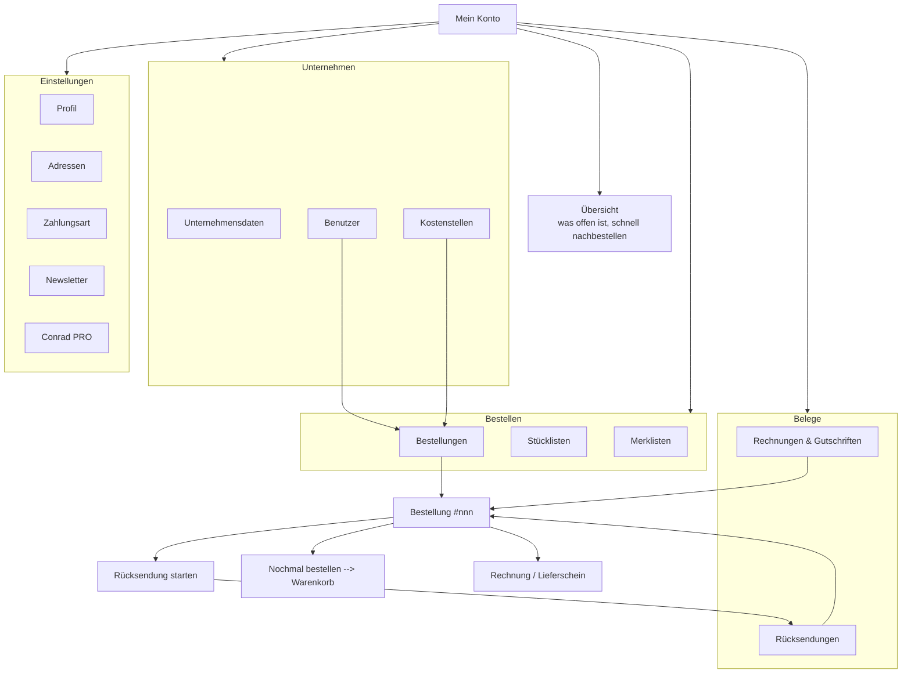

# 02 Concept: Conrad account area

Phase 2. Built on the findings in `01-analysis.md`, the baseline in
`00-prototype-baseline.md`, and the corrections received:

- build the pages the way the prototype is built, ignore Fuse, shadcn and Tailwind
- simple company layer, no roles, no permissions, no approvals
- net prices throughout, the production screens are B2C
- the degraded rows in the order list were a loading state
- bulk download and export: recommendation wanted
- Conrad PRO at 19,95 € is the B2C price, not relevant here
- mobile comes later

Branch: `concept/account-area`. `wago221.html`, `cart.html` and
`stueckliste.html` are untouched.

---

## 1. Design principles

Five, each tied to the findings it answers.

### P1 Was offen ist, steht vorn

The account area opens with what needs a decision today, not with a copy of the
navigation. Open invoices, shipments in transit, returns under review. If
nothing is open, the band is empty and the page starts with the work.

Answers A9, B1, C4, and the missing overview in the executive summary.

### P2 Jede Liste kann man durchsuchen, filtern und mitnehmen

Every list view has a search field, filters that match how a buyer thinks
(status, orderer, cost centre), and an export. A list that can only be scrolled
is not a working tool for someone reconciling a month.

Answers B4, C1, C2, C6.

### P3 Eine Preisgrundlage

Netto everywhere, `zzgl. MwSt.` stated, VAT shown as its own line that actually
adds up. The account area follows the same basis as PDP and cart.

Answers B8, C7, G4.

### P4 Ein Weg, nicht zwei

Every account task stays inside the account shell. Every hint carries the link
to the place where it is resolved. No page tells the user that something is
missing without offering the way there.

Answers A1, A2, B12, D1, F5.

### P5 Wiederholen ist ein Klick

Reordering is available wherever an order or an article is shown: on the
dashboard, on the list, on the detail page, per position and for the whole
order.

Answers B3, B6, A14.

---

## 2. Target information architecture



### What changed and why

| Change | Rationale | Finding |
|---|---|---|
| Groups are labelled: Bestellen, Belege, Unternehmen, Einstellungen | Four silent hairlines forced the user to infer the grouping | A7 |
| New group "Unternehmen" with Unternehmensdaten, Benutzer, Kostenstellen | The company layer was missing entirely | A6 |
| "Stücklisten" and "Angebotsanforderung" enter the navigation | Both are core B2B tasks and both already exist in the prototype's own account drawer | A8 |
| Counters on Bestellungen, Rechnungen, Rücksendungen | The sidebar says where something is waiting without a click | A7, P1 |
| Produktvergleich leaves the account navigation | It is a shopping tool, not account data. It belongs next to the catalogue, which also removes one of the two pages that broke the shell | A1 |
| Newsletter stays, but inside the shell | Same reason, other direction: it is a setting of this account | A1, A2 |
| Belege cross link to the order and back | The same document was reachable by two unconnected routes | IA observations |
| Benutzer and Kostenstellen link into a filtered order list | The question "what did Sabine order on KST-4100" now has one path | A6 |

Open: whether "Angebotsanforderung" is in scope. It was in the first draft of
this navigation and was removed again in the rework, because it has no page and
no production screenshot behind it. Section 9 carries the navigation as built.

Also changed in the rework: "Unternehmen" is one entry rather than three. The
page carries Stammdaten, Benutzer and Kostenstellen as sections. Three entries
pointing at anchors on the same page made the current page state ambiguous.

---

## 3. Dashboard

Replaces a page that mirrored the navigation (A9). Four bands, in the order a
buyer needs them.

**1. Was offen ist.** Up to four tiles, each one a link into a pre filtered
list. Only what is non zero appears.

| Tile | Value | Note | Links to |
|---|---|---|---|
| Offene Rechnungen | sum net | how many are overdue | invoices, filtered to open |
| Sendungen unterwegs | count | next delivery date | orders, filtered to shipped |
| Bestellungen in Bearbeitung | count | date of the latest | orders, filtered |
| Rücksendungen in Prüfung | count | the RMA number | returns |

The overdue tile is the only one with a warning colour. Colour is never the only
carrier: the note says "1 davon überfällig" in words.

**2. Schnell nachbestellen.** The four most recently ordered articles, each one
only once, with the date, the order they came from, the unit price net, and one
button. This is the highest frequency task in the whole area and in production
it required opening an order first (B3).

**3. Letzte Bestellungen und offene Rechnungen**, side by side. Each row carries
a status pill, an amount and a link. The invoice rows state the due distance in
plain words ("fällig in 4 Tagen", "fällig seit 10 Tagen"), which is what C4 asks
for.

**4. Stammdaten**, three small cards: standard delivery address, payment method,
company. These are the only parts of the old dashboard worth keeping, and they
sit at the bottom because they are consulted rarely.

Not on the dashboard: Profil (A10, A11 removed with it), Merklisten (nothing
actionable to show), Produktvergleich, Newsletter.

---

## 4. Key flows

### 4.1 Find an order and check its status

| Before | After |
|---|---|
| Time window filter and a free text search with an unexplained asterisk. No status filter, no sort, no orderer. A "Zahlungsstatus" column with no values. Two rows rendered as grey bars with no explanation. | Search over number, article and reference. Filters for status, orderer and cost centre. Every column carries data. One status pill per order with the vocabulary of the order, plus "1 Position offen" on a partial shipment. |
| On the detail page: "Abgeschlossen am ...", a badge "Versendet" and a future delivery date in the same block. | One status per level: the header states who ordered, when, on which cost centre. The shipment card carries the shipment status, the carrier, the date and a four step line from Bestellt to Zugestellt. |
| Tracking number as a 20 digit link. | Copy chip with the number plus a separate link "Bei DHL verfolgen". |

Solves B1, B2, B4, B5, B10, B11, and the loading state that produced B2.

### 4.2 Reorder from the order history

| Before | After |
|---|---|
| Only inside the detail page: "Nochmal kaufen" per line, "Alle hinzufügen" as a weak text link next to the order number. | Dashboard: four articles with one button each. List: "Nochmal bestellen" on every row, which adds all positions. Detail: a primary button for the whole order plus one button per position. |

The reorder writes into `conradCart`, the same `localStorage` key the cart page
reads, so the line appears in the real cart with its image, pack size and net
price. Verified end to end: an order with a net total of 356,90 € produces a
cart with a net total of 356,90 €.

Solves B3, B6, A14, P5.

### 4.3 Find and download invoices, single and bulk

This is finding C1, the one where a recommendation was asked for.

**What a buyer actually does at month end.** Open the list, restrict to a
period, pick everything that belongs to that period, and hand the result to
accounting or to the tax adviser. In production none of the four steps is
supported: no search, no selection, no bulk action, no export.

**Recommendation, in three stages.**

*Stage 1, what the prototype shows.* A checkbox column with a select all in the
header, a bar that appears as soon as something is selected, "Auswahl als PDF
herunterladen" and "Auswahl als CSV". Plus a search over document number, order
number and amount, a status filter that includes "Überfällig", and a due date
column that says how many days are left or how many have passed. The CSV is
written with a semicolon separator, a comma as the decimal mark and a BOM, so
that a German Excel opens it in columns without an import dialogue.

*Stage 2, what a real implementation needs.* The bulk PDF has to be a server
side ZIP, not n browser downloads. Naming matters more than it looks:
`Rechnung_9784752944_2026-09-19.pdf` is what a document management system can
file automatically. The export needs a second format next to CSV, and for German
B2B that is DATEV, because the tax adviser imports it directly.

*Stage 3, what removes the task.* ZUGFeRD or XRechnung as a hybrid PDF means the
invoice carries its own structured data and the customer's ERP books it without
anyone downloading anything. At that point the list stops being a working tool
and becomes an archive, which is the right outcome.

I would not build a DATEV export before someone has confirmed that Conrad's
B2B customers actually use one. That is the first thing to test, see section 7.

Also solved here: C2 (search), C3 (credit notes get their own status vocabulary,
"Erstattet" instead of "offen"), C4 (overdue plus due date), C5 (no broken
thumbnails, documents are documents), C7 (net stated).

### 4.4 Start a return

| Before | After |
|---|---|
| "Rücksendeportal" hands the user to a separate system with no marker and no return path. The empty state is one sentence under a filter. | The return starts in the account area, from the order detail or from the returns page. The empty state carries the rules the user needs: 30 days after delivery, unopened packaging units longer, credit note always from Conrad Electronic even when a marketplace participant shipped. |
| Time window defaults to 6 months while invoices use 12 and orders 24. | One default. |
| Returns list has no link to the order. | Every return links to its order, every delivered order shows its return. |

Solves D1, D2, D3.

### 4.5 Manage company users

Deliberately the simple stage, as agreed: who orders, and what is booked where.
No roles, no permissions, no approval workflow.

- **Unternehmensdaten**: company, address, customer number as a copy chip, VAT
  ID, payment method and term, and the statement that prices are net.
- **Benutzer**: name, e-mail, function, cost centre, member since, number of
  orders, and a link into the order list filtered to that person. "Benutzer
  hinzufügen" sends an invitation. Function ("Einkauf", "Technik",
  "Buchhaltung") is a label, not a permission.
- **Kostenstellen**: number, name, order count and net total, each linking into
  the filtered order list.

A note at the top states plainly that rights, roles and approvals are not part
of this draft, so that nobody reviews it expecting them.

Solves A6 at the agreed depth.

---

## 5. Prototype pages

### How to run

No build step. Serve the repository and open a page.

```bash
python3 -m http.server 8901
```

Or use the existing preview entry `conrad-pro` in `.claude/launch.json`.

### Routes

| URL | Page |
|---|---|
| `konto.html` | Übersicht (dashboard) |
| `konto-bestellungen.html` | order list |
| `konto-bestellungen.html?status=versendet` | pre filtered, as the dashboard links it |
| `konto-bestellungen.html?person=u2` | orders of one user, as the company page links it |
| `konto-bestellungen.html?kst=KST-4100` | orders on one cost centre |
| `konto-bestellungen.html?zustand=laden` | loading state |
| `konto-bestellungen.html?zustand=fehler` | error state |
| `konto-bestellungen.html?zustand=leer` | empty state |
| `konto-bestellung.html?nr=2017621738` | order detail, in Bearbeitung |
| `konto-bestellung.html?nr=2017619004` | order detail, versendet, marketplace shipper |
| `konto-bestellung.html?nr=2017551903` | order detail, teilweise versendet |
| `konto-bestellung.html?nr=9999` | order not found |
| `konto-rechnungen.html` | invoices and credit notes |
| `konto-rechnungen.html?status=offen` | pre filtered |
| `konto-ruecksendungen.html` | returns |
| `konto-ruecksendungen.html?zustand=leer` | returns, empty state |
| `konto-unternehmen.html` | company, users, cost centres |

The reorder path to test: `konto-bestellungen.html`, "Nochmal bestellen" on any
row, then `cart.html`.

### Files added

| File | Role |
|---|---|
| `konto.css` | shared stylesheet: the two style blocks of `cart.html` verbatim, plus the toast rules and the status pill from the other two pages, plus the KONTO section |
| `konto-daten.js` | fixtures and helpers, plus the reorder into `conradCart` and the navigation counters |
| `konto.html` and five further `konto-*.html` | the pages |

Nothing existing was modified.

### Mock data

One company with three users and three cost centres, seven orders across five
status values, six documents including one credit note and one overdue invoice,
two returns. Article numbers, EAN and images are the real ones from the
prototype, so a reorder produces a working cart line rather than a name.

---

## 6. Consistency check and component mapping

### Existing components used

| Component | Origin | Used on |
|---|---|---|
| page shell: promo strip, header, both drawers, breadcrumb, legal bar footer, to top | `cart.html` verbatim | all six pages |
| `.bom-status` `.ok` `.warn` `.err` | `stueckliste.html` | every status, on all six pages |
| `.bom-table` conventions: uppercase headers, 12 px padding, horizontal scroll wrapper | `stueckliste.html` | order list, invoices, returns, users, cost centres |
| `.cart-card` surface: white, 8 px radius, 1 px `--c-border` | `cart.html` | every card |
| `.cart-empty` pattern: title, one sentence, primary plus secondary action | `cart.html` | empty states on four pages |
| `.id-chip-value` copy chip | `wago221.html` | tracking number, customer number |
| `.toast` | `wago221.html` | every confirmation |
| button hierarchy: blue fill, `--c-blue-soft` fill, ghost | all | everywhere |
| hover system by function | commit `63c8d40` | everywhere |
| `conradCart` in `localStorage` | `cart-seed.js` | reorder |
| `header-flyouts.js` | shared | header flyouts and badges |

### New components and why nothing existing fitted

| New | Why |
|---|---|
| `.konto-nav` side navigation with labelled groups and counters | the prototype has no sidebar layout at all, only the header drawer |
| `.konto-kpi` attention tile | nothing in the prototype states a quantity with a route behind it |
| `.konto-toolbar`, `.konto-search`, `.konto-select` | the prototype has no filter row. `.bom-chip` filters by one dimension only and does not scale to four |
| `.konto-bulk` selection bar and `.konto-check` | no multi select exists anywhere |
| `.konto-skeleton` loading row | the prototype has no loading state. This one carries a `visually-hidden` row saying "Bestellungen werden geladen" and `aria-busy`, which is exactly what production's grey bars were missing |
| `.konto-error` | no page level error pattern exists |
| `.konto-note` hint with a built in action | production has hints without a route (B12); this one cannot exist without its link |
| `.konto-steps` shipment progress | nothing comparable exists |
| `.konto-dl`, `.konto-pos`, `.konto-sum` | layout primitives for record pages |

### Deviations from the baseline, declared

1. **A shared stylesheet.** The existing pages carry their CSS inline. Six
   copies of a 2000 line stylesheet would guarantee drift, which
   `00-prototype-baseline.md` §9.1 already names as the baseline's own
   weakness. `konto.css` is a new file and a deliberate deviation. The shell
   markup stays inline per page, as in the existing pages.
2. **Three components had to be copied between pages.** `.visually-hidden`,
   `.toast` and `.bom-status` live in `wago221.html` or `stueckliste.html` but
   not in `cart.html`, whose stylesheet formed the base. They are marked as
   copied in `konto.css`. This is evidence for the shared stylesheet, not
   against it.
3. **Three breakpoints instead of fourteen.** The account pages use 900 and 640
   only. The baseline counts fourteen values across the three existing pages.
4. **`max-width` of the content.** The account pages keep the prototype's
   1680 px, not the roughly 1150 px of the production account area. Consistency
   with PDP and cart was the stated priority.
5. **Net prices.** A deliberate contradiction of the production screens,
   confirmed as intended.

### Proposed changes to existing pages, not implemented

Per the constraint, these are proposals only.

1. **`cart.html` and `wago221.html`, account drawer.** Eleven of the twelve
   entries point at `#`. They should point at the new pages, otherwise the route
   from cart back into the account does not exist. Reorder from the account into
   the cart already works, the reverse does not.
2. **`cart.html`, order confirmation.** There is no confirmation page in the
   prototype. When one is built it should link to `konto-bestellung.html?nr=...`.
3. **`.bom-status` and `.bom-table` into a shared file.** They are now used by
   four pages, not one.

---

## 7. Validation plan

The concept makes six assumptions. Each one can be wrong, and each one has a
cheap test.

| # | Hypothesis | Test | Success metric |
|---|---|---|---|
| H1 | Buyers open the account area to find out what needs attention, not to navigate | Five minute first click test on the dashboard: "You start your working day. What do you check first?" | at least 7 of 10 click inside the attention band |
| H2 | Reorder from the list removes a real detour | Task: "Order the same terminals as in September again." Compare with the production path | median time at least 40 per cent lower, no participant opens the detail page first |
| H3 | Month end needs bulk and export, not a better single download | Task with an accounting role: "Hand August over to your tax adviser." Observe whether they select, export, or download individually | at least 6 of 8 use selection or export. If they download individually, stage 2 of 4.3 is not worth building |
| H4 | The simple company layer is enough, roles are not missed | Interview after the task: "Whose orders can you see here, and whose should you be able to see?" | fewer than 3 of 10 ask for permissions unprompted. If more do, A6 has to grow |
| H5 | Net prices do not confuse | Task: "How much does this order cost you in total?" | no participant reads the net amount as the total |
| H6 | The status vocabulary is understood | Card sort of the seven status words against real situations | at least 80 per cent correct assignment, "Teilweise versendet" is the one to watch |

Two things that cannot be tested this way and need instrumentation instead:
how often the attention band is actually empty, and how many invoices a typical
selection contains. Both decide whether the design scales past this fixture set.

---

## 8. Risks and dependencies

**Data the backend has to provide and might not.**

- Cost centre and orderer per order. Everything in the company layer depends on
  it. If orders are only attached to a customer number, the users page shows
  three rows and the filters do nothing.
- Due date and payment status per invoice. Without them C4 cannot be built, and
  the overdue tile on the dashboard disappears.
- Carrier and shipment status, not only a tracking number. The four step line is
  a promise the data has to keep.
- A reliable article reference per order line. The reorder maps position to
  article, pack size and price. Articles that no longer exist need a rule, and
  the prototype does not have one.

**Decisions that are not design decisions.**

- Whether the return starts inside the account area or in the existing portal.
  The concept assumes the former. If the portal stays, D1 is only half solved
  and the handover has to be marked.
- Whether DATEV is worth building. See H3.
- Whether the "Angebotsanforderung" entry has a page behind it.
- Whether Conrad already runs a company account elsewhere. The answer was that
  the footer links can be ignored, so the concept builds the layer. If the
  Sourcing Platform later turns out to own it, this page becomes a link.

**Known gaps in this draft.**

- Mobile. Deferred by agreement. The pages stack and do not overflow, but the
  tables scroll horizontally and the side navigation becomes a chip row. That is
  a stopgap, not a design.
- Profil, Adressen, Zahlungsart, Newsletter and Conrad PRO exist in the
  navigation without pages. The findings for them (F1 to F8, A10, A11) are
  documented but not implemented.
- Keyboard and screen reader behaviour was not tested. The loading state carries
  `aria-busy` and a text row, labels are real `<label>` elements rather than
  placeholders (H3), and every status is a word next to its colour. That is the
  floor, not a verified result.

---

## 9. Überarbeitung nach dem ersten Durchgang

Review findings from the first walk through the prototype, and what was changed.

### Defects found and fixed

| # | Defect | Cause | Fix |
|---|---|---|---|
| R1 | The copy chip rendered as a full size icon stacked above the number | The whole `.id-chip*` family lives in `wago221.html`, not in `cart.html`, whose stylesheet formed the base of `konto.css`. Sixteen rules were missing. | Copied into `konto.css` and marked as copied. This is now the fourth component in that situation, after `.visually-hidden`, `.toast` and `.bom-status`. |
| R2 | Seven of thirteen navigation entries pointed at `#` | Only the six pages of the agreed minimum scope existed | Six further pages built: Profil, Adressen, Zahlungsart, Merklisten, Newsletter, Conrad PRO. Every navigation entry now has a target. |
| R3 | "Stücklisten" led to a page without the account navigation | It links to the existing tool page, which has no account shell. This reproduced finding A1 inside my own draft. | The entry keeps its target but is marked as leaving the account area, with an icon and a `visually-hidden` note "(verlässt den Kontobereich)". Building an account wrapper around the tool would duplicate it, changing the tool itself is out of scope. |
| R4 | Name and explanation ran together in the payment options | `.konto-option-name` and `.konto-option-note` were inline spans | Both are blocks |
| R5 | A disabled primary button looked ready to press | `.konto-btn:disabled` stood before `.konto-btn.primary` at the same specificity, so the variant won | The disabled rule now stands after the variants |
| R6 | Definition list rows wrapped inside three column cards | `dt` was 152 px, `dd` 200 px, together wider than the card | 120 px and 140 px |

### 8 dp spacing

The KONTO section of `konto.css` was rewritten against a grid of 4, 8, 12, 16,
24, 32, 40, 48. Before: 1, 2, 3, 4, 5, 6, 7, 8, 9, 10, 12, 14, 16, 18, 20, 22,
24, 36, 40, 64. After: 4, 8, 16, 24, 40, plus 1 for hairlines and 11 for the
optical centring of the shipment line against a 16 px dot.

Control heights are 40 (8 times 5), which also clears the target size floor.
Navigation entries have `min-height: 40`.

The inherited part of `konto.css`, the roughly 2000 lines from `cart.html`, was
not touched. It follows no grid, which is recorded in
`00-prototype-baseline.md` §4 and §9.2. Bringing the existing pages onto a grid
would mean editing them, which is out of scope.

### Accessibility, second pass

Added:

- **Skip link** on every page, visible on focus, jumping to the content column.
  The prototype has none.
- **Visible focus ring** on navigation, tiles, buttons, search, selects,
  checkboxes and table links. The inherited stylesheet has no consistent focus
  treatment.
- **`scope="col"` on all 35 table headers.** Without it a screen reader does not
  tie a cell to its column, which matters most on the twelve column order list.
- **`aria-live="polite"`** on the result counts of the order and invoice lists
  and on the bulk selection bar, so a filter change and a selection are
  announced.
- **`aria-busy` plus a text row** on the loading state, which was already there
  and is what production's grey bars lacked.
- **The external marker is text, not only an icon** (R3).

Measured on the built pages, contrast against the actual background:

| Element | Ratio |
|---|---|
| KPI value 20 px bold | 14.0 |
| Status pill 12 px 600 | 10.6 |
| Button label 14 px 500 | 12.9 |
| KPI label 13 px | 6.2 |
| Navigation group title 11 px 600 | 6.2 |
| Navigation counter 11 px 600 | 5.9 |
| Page subtitle 13 px | 5.7 |
| KPI note 12 px | 5.3 |
| Overdue note 12 px 600 on white | 5.0 |

Lowest value 5.0 against a requirement of 4.5. Heading order is h1 then h2 on
every page, no level skipped. No pointer target below 24 px. No page overflows
horizontally at 1440 px.

Still not verified: actual keyboard traversal and a screen reader run. The
above is what static inspection and measurement can establish.

### Conrad PRO

Rebuilt as the loyalty programme rather than a sales page. It shows the
membership state (member since, renewal date, annual fee net, link to the
membership invoices), what the membership returned in the last twelve months
(shipping waived on twelve shipments, PRO prices against list prices, both
against the fee), the benefits, and a cancellation path. The 19,95 € from the
production screen is the consumer price and does not appear.

Solves F7 and F8.

### Navigation logic after the rework

Five groups, twelve entries, every one with a target:

- **Übersicht**
- **Bestellen**: Bestellungen (counter), Stücklisten (leaves the area),
  Merklisten
- **Belege**: Rechnungen & Gutschriften (counter, warning colour when something
  is overdue), Rücksendungen (counter)
- **Unternehmen**: one entry, the page carries Stammdaten, Benutzer and
  Kostenstellen as sections. The earlier separate "Benutzer" entry pointing at
  an anchor on the same page made the current page state ambiguous.
- **Einstellungen**: Profil, Adressen, Zahlungsart, Newsletter, Conrad PRO

Cross links that now exist in both directions: order and invoice, order and
return, user and their orders, cost centre and its orders, payment option and
the bank details it requires, profile and company data.

---

## 10. Übersicht entrümpelt

Review note: the two list cards and the three reference cards had ragged
bottoms. Measured at 1680 px: 377 against 301 px in the list row, 196 / 129 /
129 in the row below.

The heights were the symptom. The cause was that ten bordered containers on one
page gave three different kinds of content the same weight. An overdue invoice
and the company's own delivery address carried the same border, the same heading
size and the same blue link in the top right corner.

### What was built

**Equal height with the spare space earning its keep.** The list row stretches,
and each card gets a footer pinned to its bottom edge. The footer says something
about the whole stock, not about the four rows above it:

- Bestellungen: "7 Bestellungen in den letzten 12 Monaten"
- Rechnungen: "3.360,85 € offen, davon 92,95 € überfällig"

The "Alle anzeigen" link moves from the heading row into the footer, so the
heading row carries nothing but the heading, and the link sits where the eye
finishes reading.

**Three reference cards become one strip.** Standard delivery address, payment
method and company now sit in a single bordered block with three columns and
hairline dividers. Labels drop from h2 in a box to a small uppercase label, and
each column keeps its own link. Equal height by construction.

**The reorder card shows three articles instead of four.** At 557 px it was the
tallest element on the page and pushed both lists below the fold.

### Result

| | before | after |
|---|---|---|
| bordered containers | 10 | 8 |
| list row | 377 / 301 px | 427 / 427 px |
| reference row | 196 / 129 / 129 px | one strip, 149 px |
| reorder card | 557 px | 426 px |
| page height | 2043 px | 1726 px |

### Rejected

**Tabs over the two lists.** One container instead of two, but it hides the
overdue invoice behind a click. That is the one thing the page exists to show.

**Merging both lists into one "Letzte Vorgänge".** Fewer boxes, but orders and
documents are two mental models with two different actions.

**Dropping the reference data from the dashboard entirely.** That would be seven
containers and the page would end with the work rather than with lookup data.
Against it: before a large order, a glance at which address and which payment
method are active is worth something. Recorded as an option, not built.

---

## 11. Stücklisten wird ein Ort, und zwei erfundene Felder verschwinden

Review note: the navigation entry "Stücklisten" pointed straight at the existing
tool page and carried an external link marker. Challenged as not best practice.
Correct.

### Why the marker was wrong

The diagonal arrow conventionally means: this leaves the current context, to a
foreign domain, another system or a new window. None of that applied.
`stueckliste.html` is the same site, the same prototype, the same authenticated
state, the same tab, and a Conrad tool.

So the icon did not describe the user's world. It described **my
implementation**: that one page lacks my sidebar. It marked finding A1 instead
of fixing it. Honest, not good.

### The deeper mistake

The navigation is a list of **places**: Übersicht, Bestellungen, Merklisten,
Rechnungen, Rücksendungen, Unternehmen, Profil, Adressen, Zahlungsart. Nouns,
where something is kept.

"Stücklisten" was the only **tool** among them, a verb dressed as a noun. The
entry promised "here are my bills of material" and delivered "here you upload
one". That breaks the pattern independently of the missing shell.

And something a buyer needs was missing: whoever uploads and matches a bill of
material wants to find it again, reorder it next quarter, hand it to a
colleague, compare it with the previous version. Until now the list was gone
after the cart.

### What was built

**`konto-stuecklisten.html`**, a list of saved bills of material, exactly as
Merklisten lists wishlists and Bestellungen lists orders. Columns: Stückliste,
Zuletzt geändert, Abgleich, Positionen, Summe netto, Zuletzt bestellt.

"Abgleich" carries the match result as a status pill, "Vollständig" or "5 zu
prüfen", because that is the reason someone reopens a list. A list with open
positions cannot go into the cart as a whole, and the button says so.

The tool becomes an **action on that page** ("Neue Stückliste hochladen"), not a
navigation target. The arrow marker is gone because nothing is being left. The
`.konto-nav-extern` rule was removed with it rather than left as dead code.

The navigation is once again nouns only.

### Two invented fields removed

"Angelegt von" stood in the Merklisten table. That data does not exist:
wishlists belong to the company account, not to a person. The column is gone and
the field was deleted from the fixtures so nobody puts it back. The bill of
material list was built without an owner column for the same reason.

This is worth recording as a rule for the rest of the concept: a column only
exists when the data behind it exists. Finding B1 is the production version of
the same mistake, a "Zahlungsstatus" column with nothing in it.

### Still open, needs approval

**Give `stueckliste.html` the account shell.** Then the matching itself sits
inside the area and the user does not lose the navigation while uploading. That
means editing an existing page, so it is proposed, not done. Until then the list
page links into the tool, which still opens without a sidebar. The gap is one
page deep instead of sitting in the navigation.

### Known limitation

The disabled cart button explains itself through a `title` attribute, which
screen readers do not announce reliably and which a disabled button cannot
receive focus for. It is acceptable here only because the adjacent "Abgleich"
column states the reason visibly. If the pattern spreads, the reason has to
become visible text.
